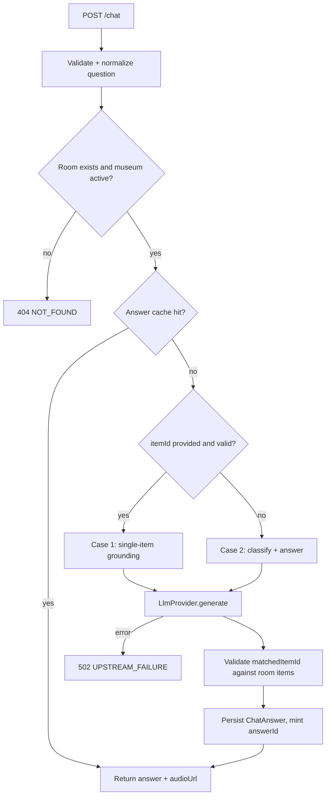
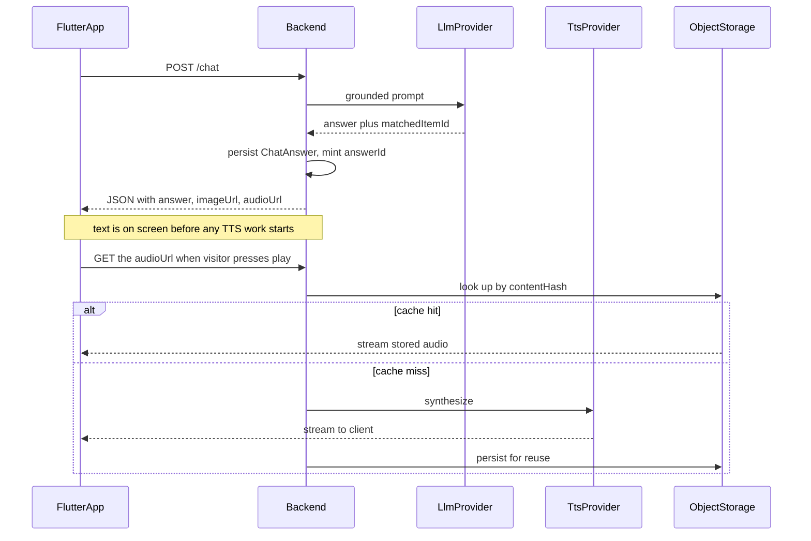

# Adwa AI Tour Guide — Backend Implementation Plan (v2)

**Status:** active specification.
**Supersedes:** `Adwa_Backend_Implementation_Plan.md` (v1).

This document is the backend's contract with the Flutter visitor app and the admin web app. It is written to be built against directly: every route, every field, every validation rule, and every third-party interaction is specified here.

It is a revision of v1, not a rewrite. v1's core architecture — a single multi-tenant Express service, JWT admin auth, database-resolved tenant scoping, and grounded-only chat answers — is correct and is preserved. What changed is recorded in §2, with the reasoning for each change, so that nothing here reads as an unexplained deviation.

---

## Table of contents

1. [Scope and goals](#1-scope-and-goals)
2. [Changes from v1](#2-changes-from-v1)
3. [Tech stack](#3-tech-stack)
4. [Repository layout](#4-repository-layout)
5. [Environment variables](#5-environment-variables)
6. [Data model](#6-data-model)
7. [Error handling and API conventions](#7-error-handling-and-api-conventions)
8. [Authentication and authorization](#8-authentication-and-authorization)
9. [Visitor-facing API](#9-visitor-facing-api)
10. [Chat grounding logic](#10-chat-grounding-logic)
11. [Audio and narration pipeline](#11-audio-and-narration-pipeline)
12. [Provider adapters](#12-provider-adapters)
13. [Cost and abuse controls](#13-cost-and-abuse-controls)
14. [Admin API](#14-admin-api)
15. [Ticket validation](#15-ticket-validation)
16. [Seeding existing content](#16-seeding-existing-content)
17. [Testing strategy](#17-testing-strategy)
18. [Implementation phases](#18-implementation-phases)
19. [Deployment](#19-deployment)
20. [Out of scope](#20-out-of-scope)
21. [Open questions](#21-open-questions)

---

## 1. Scope and goals

The backend is a single Express service with three responsibilities:

1. **Serve visitor-facing content** — room and item data, grounded chat answers, and generated audio — to the Flutter app, for any number of museums.
2. **Serve admin operations** — authentication and CRUD on museums, rooms, and items — to a role-based admin web app.
3. **Own every third-party credential.** Nothing outside this service ever holds an API key, a vendor URL, or a database connection string. The Flutter app and the admin app talk only to this backend.

Everything below assumes multi-tenancy: multiple museums, each with isolated content, each with its own admins, all served by one deployment.

**The single most important correctness property in this system is tenant isolation.** A museum admin must never read or write another museum's content. Every design decision that follows defers to that.

**The single most important product property is answer fidelity.** This is a memorial museum. A confidently wrong answer is a real failure, not an inconvenience. The system never fabricates, and it fails visibly rather than plausibly.

---

## 2. Changes from v1

Each change below is either a correction of an internal contradiction in v1, a gap that would have caused rework, or a mismatch between v1 and the content already sitting in `data/`.

### 2.1 Corrections — v1 contradicted itself or the data

| # | Issue in v1 | Resolution |
|---|---|---|
| C1 | **`/chat` audio contract is impossible.** §6.2 returns a JSON body containing `audioUrl`; §7.4 says stream the TTS instead of waiting for the full file. One HTTP response cannot be both a JSON object and a streamed audio body. | `/chat` returns JSON immediately, with `audioUrl` pointing at a separate streaming endpoint the client fetches on playback. See §9.2 and §11. |
| C2 | **`POST /narrate` is an open TTS API.** It is public, unauthenticated, and accepts arbitrary `text`, so anyone who finds the URL can bill the ElevenLabs account without limit. | The public text-accepting route is removed. Replaced by `GET /narrate/room/:roomId`, `GET /narrate/answer/:answerId`, and an authenticated `POST /admin/narrate`. Clients can never submit text for synthesis. See §11. |
| C3 | **Room IDs collide across museums.** v1 §4.2 calls global room-ID uniqueness "the load-bearing decision in the whole schema," but `data/waypoints_adwa.json` and `data/waypoints_louvre.json` both use `room_1`–`room_4`. | Seeding generates fresh UUIDs and records the original ID in `Room.legacyId` / `Item.legacyId`, scoped unique per museum. See §16. |
| C4 | **Addis AI cannot serve an English-only product.** Its `POST /api/v1/chat_generate` requires `target_language` of `"am"` or `"om"`; the platform is purpose-built for Amharic and Afan Oromo. v1 §13 cuts Amharic entirely. | The LLM sits behind an `LlmProvider` interface with a general English model as the default. Addis AI remains a registered adapter so Amharic is a provider swap, not a rewrite. See §12. |

### 2.2 Schema additions — v1 dropped data that already exists

| # | Addition | Why |
|---|---|---|
| S1 | `Room.narrationScript` | Both datasets carry `room_narration_script` *separately* from `room_overview_text`. They serve different purposes: the script is sent to TTS, the overview grounds the chat. v1's schema has only `roomOverviewText`, so the script would be silently lost at seed time. |
| S2 | `Museum.systemPrompt` | `data/system_prompt_adwa.md` and `data/system_prompt_louvre.md` are distinct personas. A multi-tenant system needs per-museum persona storage; v1 has none, forcing one hardcoded persona across all tenants. |
| S3 | `Museum.defaultVoiceId` | Same reasoning, for TTS voice. |
| S4 | `@@unique([museumId, storyOrder])` on `Room` | Nothing in v1 stops two rooms in one museum claiming position 3. |
| S5 | `Item.displayOrder` | v1 gives items no ordering, so the app renders them in whatever order Postgres happens to return. |
| S6 | `createdAt` / `updatedAt` on `Room` and `Item` | Present on `Museum` in v1, missing on the models that are actually edited. |
| S7 | Explicit referential actions | v1 specifies none. Deleting a room another room points at would either fail opaquely or orphan the tour chain. |
| S8 | `AudioAsset`, `ChatAnswer`, `AdminAuditLog` models | Back the TTS cache, the answer cache plus `audioUrl` token, and the admin change history respectively. |
| S9 | `legacyId` on `Room` and `Item` | Reconciles printed QR codes and existing client fixtures with regenerated UUIDs (see C3). |

### 2.3 Missing surface area

| # | Gap | Resolution |
|---|---|---|
| M1 | **No DELETE routes at all.** v1 §9 has only GET/POST/PATCH. Content authoring without deletion is unworkable. | `DELETE /admin/items/:id` and `DELETE /admin/rooms/:id` added; museums use soft-delete via the existing `SUSPENDED` status. See §14. |
| M2 | **No cycle detection on `nextRoomId`.** v1 §9.4 checks only same-museum, so `A -> B -> A` is accepted and the tour loops forever. | Full chain walk on write. See §14.3. |
| M3 | **Suspended museums don't revoke admin access.** v1 §6.1 hides content from visitors, but the admin's 12-hour JWT keeps working. | `requireAuth` re-checks museum status on every request. See §8.2. |
| M4 | No pagination on any list endpoint. | Cursor pagination on all admin list routes. See §14. |
| M5 | `Museum.slug` is `@unique` but no route reads it. | `GET /museums/:slug` added for the admin app's museum switcher. |

### 2.4 Cost and abuse controls — absent from v1 entirely

`/chat` is public, unauthenticated, and spends money at two vendors on every call. v1 specifies no rate limiting, no caching, no input caps, and no timeouts. All are added in §13. The answer cache in particular is the difference between hundreds and tens of thousands of LLM calls per day, because in a museum the same handful of questions get asked all day long.

### 2.5 Process changes

| # | Change | Why |
|---|---|---|
| P1 | **Error envelope and structured logging move from phase 8 to phase 1.** | v1 §12 puts standardizing error responses last, "if they've drifted during earlier phases." They will have drifted, across every route, and retrofitting a response shape is pure rework. |
| P2 | **The §10 isolation checklist becomes automated tests.** | As a manual list run at the end of phase 4 and again at phase 8, in practice it gets run once. As Vitest + Supertest tests it runs on every commit — and v1 itself says this is the one thing that "can't be hand-waved." |
| P3 | **A phase 0 is added for the shared contract.** | Three teams build against this backend but v1 produces no contract artifact, so the Flutter and admin-web developers are blocked until real endpoints exist. Phase 0 ships an OpenAPI document and a mock server derived from it. |

### 2.6 What is deliberately unchanged from v1

Stated explicitly so the corrections above don't read as a rewrite:

- The tenant-isolation model, including the rule that `requireMuseumScope` resolves the museum from the database record and never from the request body. This is the most important single line in v1 and it is preserved verbatim in §8.4.
- Returning `404` rather than `403` for a suspended museum's content, so platform-internal state is not revealed to visitors.
- Refusing to fabricate an answer when the LLM errors — return `502` and let the client show a clear failure state.
- The two-case chat grounding split (item specified vs. free-form) and the requirement to validate a model-returned `matchedItemId` against the room's real item IDs.
- The argument in v1 §7.3 that this route needs adversarial and fact-fidelity testing, not just happy-path testing.
- Globally unique `Room.id` so a QR code encodes exactly one value and the visitor API needs no museum context.

---

## 3. Tech stack

| Layer | Choice | Why |
|---|---|---|
| Language | TypeScript (strict) | Three teams share this contract. Types are the cheapest way to keep the Flutter and admin-web developers honest about response shapes, and they make tenant-scoping mistakes visible at compile time. |
| Runtime | Node.js 20 LTS + Express 4 | Simple, well-understood, fast to iterate on. |
| Database | PostgreSQL 15+ | Relational integrity matters with more than one tenant — foreign keys enforce that a room cannot dangle without a museum. |
| ORM | Prisma | Fast schema iteration, real migrations, and a query API that makes tenant scoping explicit rather than easy to forget. |
| Validation | Zod | One schema per endpoint, reused for runtime validation and for generating the OpenAPI document, so the contract cannot drift from the code. |
| Auth | JWT (stateless) | No session store; the token carries `role` and `museumId`. |
| Password hashing | bcrypt (cost 12) | Standard. |
| Testing | Vitest + Supertest | Integration tests against a real throwaway Postgres, because the properties worth testing here are database-scoping properties that mocks would paper over. |
| Logging | pino | Structured JSON logs with a request ID on every line. |
| Hosting | Render (Web Service + managed Postgres) | One platform, minimal ops overhead. |
| LLM | Provider adapter, general English model by default | See §12.1 and C4. |
| TTS | ElevenLabs `eleven_flash_v2_5`, streamed | Built for low latency, which is what a live chat answer needs. |
| Object storage | Provider adapter, S3-compatible | **Render's filesystem is ephemeral** — anything written at runtime is lost on redeploy. Generated audio must live in object storage. Vendor deferred; see §12.3. |

There is no speech-to-text in this stack. Transcription happens on-device in the Flutter app; the backend never receives raw audio. See §9.4.

---

## 4. Repository layout

```
backend/
  prisma/
    schema.prisma
    migrations/
    seed.ts                 # seeds system admin + both museums from data/*.json
  src/
    index.ts                # process entrypoint, graceful shutdown
    app.ts                  # express app assembly (exported for tests)
    config/
      env.ts                # Zod-validated process.env, fails fast at boot
    lib/
      prisma.ts
      logger.ts
      errors.ts             # ApiError class + error code constants
      hash.ts               # content hashing for the caches
      asyncHandler.ts
    middleware/
      requestId.ts
      requireAuth.ts
      requireRole.ts
      requireMuseumScope.ts
      rateLimit.ts
      errorHandler.ts       # terminal handler, owns the response envelope
    modules/
      auth/                 # router + service + schemas
      museums/
      rooms/
      items/
      waypoints/            # visitor read path
      chat/
      narrate/
      tickets/
    providers/
      llm/      { types.ts, openai.ts, addisai.ts, index.ts }
      tts/      { types.ts, elevenlabs.ts, index.ts }
      storage/  { types.ts, s3.ts, memory.ts, index.ts }
  tests/
    integration/
      isolation.test.ts     # the §17.2 tenant matrix
      auth.test.ts
      rooms.test.ts
      items.test.ts
      chat.test.ts
    helpers/
  openapi/
    openapi.yaml            # generated from the Zod schemas
```

Each module directory holds a `router.ts` (HTTP concerns only), a `service.ts` (business logic and Prisma access), and a `schemas.ts` (Zod). Routers never touch Prisma directly. This keeps the tenant-scoping logic in one testable place per resource.

---

## 5. Environment variables

Validated by Zod at boot in `src/config/env.ts`. **The process refuses to start if any required variable is missing or malformed** — a backend that boots with a missing `JWT_SECRET` and fails on first login is worse than one that never boots.

```bash
# Core
NODE_ENV=                      # development | test | production
PORT=3000
DATABASE_URL=                  # Postgres connection string
JWT_SECRET=                    # >= 32 chars; rotate invalidates all sessions
JWT_EXPIRES_IN=12h
CORS_ALLOWED_ORIGINS=          # comma-separated; admin web app origin(s)

# LLM provider (see §12.1)
LLM_PROVIDER=openai            # openai | addisai
LLM_API_KEY=
LLM_MODEL=
LLM_TIMEOUT_MS=15000

# TTS provider (see §12.2)
TTS_PROVIDER=elevenlabs
ELEVENLABS_API_KEY=
ELEVENLABS_MODEL=eleven_flash_v2_5
ELEVENLABS_DEFAULT_VOICE_ID=
TTS_TIMEOUT_MS=20000

# Object storage (see §12.3)
STORAGE_PROVIDER=s3            # s3 | memory (memory = tests only)
STORAGE_BUCKET=
STORAGE_REGION=
STORAGE_ENDPOINT=              # set for S3-compatible non-AWS vendors
STORAGE_ACCESS_KEY_ID=
STORAGE_SECRET_ACCESS_KEY=
STORAGE_PUBLIC_BASE_URL=       # CDN or public bucket URL used to build audio URLs

# Cost controls (see §13)
CHAT_RATE_LIMIT_PER_5MIN=20
CHAT_MAX_QUESTION_CHARS=500
ANSWER_CACHE_TTL_HOURS=24
```

`FIRECRAWL_API_KEY` and `FAL_API_KEY` from v1 are **not** listed here. They are used only by offline authoring scripts, never at runtime, so they belong in the authoring environment and should not be present in the deployed service at all. Granting the runtime credentials it never uses is a needless blast-radius increase.

---

## 6. Data model

### 6.1 Schema

```prisma
generator client {
  provider = "prisma-client-js"
}

datasource db {
  provider = "postgresql"
  url      = env("DATABASE_URL")
}

enum MuseumStatus {
  ACTIVE
  SUSPENDED
}

enum AdminRole {
  SYSTEM_ADMIN
  MUSEUM_ADMIN
}

model Museum {
  id                  String       @id @default(uuid())
  name                String
  slug                String       @unique
  status              MuseumStatus @default(ACTIVE)
  ticketValidationUrl String?      // null = no ticketing gate for this museum
  systemPrompt        String?      @db.Text  // per-museum guide persona (S2)
  defaultVoiceId      String?                // per-museum TTS voice (S3)
  createdAt           DateTime     @default(now())
  updatedAt           DateTime     @updatedAt

  adminUsers AdminUser[]
  rooms      Room[]
  auditLogs  AdminAuditLog[]

  @@index([status])
}

model AdminUser {
  id           String    @id @default(uuid())
  email        String    @unique
  passwordHash String
  role         AdminRole
  museumId     String?   // null for SYSTEM_ADMIN, required for MUSEUM_ADMIN
  museum       Museum?   @relation(fields: [museumId], references: [id], onDelete: Restrict)
  lastLoginAt  DateTime?
  createdAt    DateTime  @default(now())
  updatedAt    DateTime  @updatedAt

  auditLogs AdminAuditLog[]

  @@index([museumId])
}

model Room {
  id               String   @id @default(uuid())  // globally unique — a QR code encodes this
  legacyId         String?                        // original id from data/*.json (S9)
  museumId         String
  museum           Museum   @relation(fields: [museumId], references: [id], onDelete: Restrict)
  storyOrder       Int
  title            String
  roomOverviewText String   @db.Text              // grounding prose for chat
  narrationScript  String   @db.Text              // spoken script sent to TTS (S1)
  roomAudioUrl     String?                        // pre-generated narration audio
  nextRoomId       String?
  nextRoom         Room?    @relation("RoomSequence", fields: [nextRoomId], references: [id], onDelete: SetNull)
  previousRooms    Room[]   @relation("RoomSequence")
  createdAt        DateTime @default(now())
  updatedAt        DateTime @updatedAt

  items       Item[]
  chatAnswers ChatAnswer[]

  @@unique([museumId, storyOrder])   // (S4)
  @@unique([museumId, legacyId])
  @@index([museumId])
  @@index([nextRoomId])
}

model Item {
  id               String   @id @default(uuid())
  legacyId         String?
  roomId           String
  room             Room     @relation(fields: [roomId], references: [id], onDelete: Cascade)
  name             String
  shortDescription String
  detailText       String   @db.Text
  imageUrl         String?
  displayOrder     Int      @default(0)   // (S5)
  createdAt        DateTime @default(now())
  updatedAt        DateTime @updatedAt

  chatAnswers ChatAnswer[]

  @@unique([roomId, legacyId])
  @@index([roomId, displayOrder])
}

// Deduplicates TTS output. Key is a hash of the exact synthesis inputs,
// so identical text in the same voice is only ever paid for once.
model AudioAsset {
  id          String   @id @default(uuid())
  contentHash String   @unique
  url         String
  voiceId     String
  model       String
  durationMs  Int?
  byteSize    Int?
  createdAt   DateTime @default(now())
}

// Serves two purposes: the answer cache, and the durable handle behind
// the audioUrl returned by POST /chat (C1).
model ChatAnswer {
  id           String   @id @default(uuid())
  roomId       String
  room         Room     @relation(fields: [roomId], references: [id], onDelete: Cascade)
  itemId       String?
  item         Item?    @relation(fields: [itemId], references: [id], onDelete: SetNull)
  questionHash String   @unique   // sha256(roomId : itemId : normalizedQuestion)
  question     String   @db.Text
  answer       String   @db.Text
  audioHash    String?            // -> AudioAsset.contentHash once synthesized
  createdAt    DateTime @default(now())

  @@index([roomId])
  @@index([createdAt])
}

model AdminAuditLog {
  id          String    @id @default(uuid())
  adminUserId String
  adminUser   AdminUser @relation(fields: [adminUserId], references: [id], onDelete: Cascade)
  museumId    String?
  museum      Museum?   @relation(fields: [museumId], references: [id], onDelete: SetNull)
  action      String    // CREATE | UPDATE | DELETE
  entityType  String    // Museum | Room | Item | AdminUser
  entityId    String
  before      Json?
  after       Json?
  createdAt   DateTime  @default(now())

  @@index([museumId, createdAt])
  @@index([adminUserId, createdAt])
}
```

### 6.2 Design notes

**`Room.id` is globally unique across all museums, not scoped per-museum.** This is the load-bearing decision in the schema and it carries over from v1 unchanged. A QR code encodes exactly one room ID. The visitor app never needs to know which museum it is looking at — `GET /waypoint/:id` derives the museum internally through the `museum` relation and checks its status. The visitor API surface stays identical no matter how many museums exist.

**`AdminUser.museumId` is nullable specifically to distinguish the two roles without a second table.** A `SYSTEM_ADMIN` has `museumId: null` and may act on any museum. A `MUSEUM_ADMIN` has it set, and every write is checked against it (§8.4).

**Referential actions are explicit (S7), and each choice is deliberate:**

- `Room.museum` is `Restrict`. A museum with rooms cannot be hard-deleted; suspension is the supported path.
- `Room.nextRoom` is `SetNull`. Deleting a room breaks the chain rather than cascading through the whole tour, which would be catastrophic.
- `Item.room` is `Cascade`. Items have no meaning without their room.
- `ChatAnswer.item` is `SetNull`, `ChatAnswer.room` is `Cascade`. Cached answers follow their room but survive an item deletion long enough to be invalidated cleanly.

**`Room.legacyId` and `Item.legacyId` are unique per museum, not globally.** Both museums use `room_1`, so a global unique constraint would reject the second museum at seed time — which is exactly the collision described in C3.

**Answer cache invalidation.** `ChatAnswer` rows are cached against content that admins can edit. Any successful write to a room, or to any item in that room, deletes every `ChatAnswer` for that room. Without this, an admin fixes a historical inaccuracy and visitors keep receiving the old answer for another 24 hours — which at a memorial museum is the exact failure mode this system is built to avoid.

**No `language` field anywhere.** Single-language by design (§20). If a second language returns, it becomes a column on `Room`, `Item`, and `ChatAnswer.questionHash`, and the `LlmProvider` adapter (§12.1) is where the vendor switch happens.

---

## 7. Error handling and API conventions

Built in phase 1, before any route (P1).

### 7.1 Envelope

Every non-2xx response, from every route, has exactly this shape:

```json
{
  "error": {
    "message": "human-readable description",
    "code": "MACHINE_READABLE_CODE",
    "requestId": "01HQ...",
    "details": []
  }
}
```

`details` is present only for `VALIDATION_ERROR` and carries the per-field Zod issues. `requestId` is on every error and every log line, so a user-reported failure can be traced to a specific request without guesswork.

### 7.2 Status codes and error codes

| Status | Code | Meaning |
|---|---|---|
| 400 | `VALIDATION_ERROR` | Malformed or missing request fields. |
| 401 | `UNAUTHENTICATED` | Missing, malformed, or expired token. |
| 401 | `INVALID_CREDENTIALS` | Login failure. Deliberately does not distinguish unknown email from wrong password. |
| 403 | `FORBIDDEN` | Authenticated but the role is insufficient. |
| 403 | `CROSS_TENANT_ACCESS` | Authenticated but the resource belongs to another museum. |
| 404 | `NOT_FOUND` | Does not exist, or belongs to a suspended museum (§9.1). |
| 409 | `CONFLICT` | Unique constraint violation, e.g. duplicate `storyOrder` or `slug`. |
| 409 | `ROOM_REFERENCED` | Delete blocked because other rooms point at this one (§14.3). |
| 422 | `INVALID_ROOM_SEQUENCE` | `nextRoomId` crosses museums or creates a cycle. |
| 429 | `RATE_LIMITED` | Includes a `Retry-After` header. |
| 500 | `INTERNAL_ERROR` | Unexpected. Never leaks a stack trace. |
| 502 | `UPSTREAM_FAILURE` | A third-party call failed. The raw upstream body is logged server-side, never returned. |
| 503 | `UPSTREAM_UNAVAILABLE` | Circuit breaker is open (§12.4). |

v1 defined only 400/401/403/404/502. The additions cover cases that will occur in normal operation and would otherwise surface as an opaque 500.

### 7.3 Failure philosophy for `/chat`

If the LLM call errors, **do not fall back to a fabricated or canned answer.** Return `502` and let the client show a clear "couldn't get an answer, try again" state. A visible failure is better than a silently wrong one. This is carried over from v1 and is non-negotiable.

### 7.4 Other conventions

- All timestamps are ISO 8601 UTC.
- All IDs are UUID v4 strings.
- Request bodies are capped at 100 KB (`express.json({ limit: '100kb' })`).
- `helmet` is applied globally; CORS is restricted to `CORS_ALLOWED_ORIGINS` for `/admin/*` and open for visitor routes.
- Every response carries an `X-Request-Id` header.

---

## 8. Authentication and authorization

### 8.1 `POST /admin/login`

**Request:** `{ email, password }`
**Response:** `{ token, role, museumId, expiresAt }`

Look up `AdminUser` by email, compare with bcrypt, and on success sign a JWT containing `{ sub, role, museumId }` with a 12-hour expiry. This is an internal admin tool, not a consumer app, so a long session is fine.

On failure return `401 INVALID_CREDENTIALS` with a generic message — do not distinguish "email not found" from "wrong password." Perform a dummy bcrypt comparison when the email is unknown so response timing does not leak account existence either.

**Rate limiting (new):** 10 attempts per IP per 15 minutes, and a 15-minute lockout after 5 consecutive failures for a given email. v1 specified no brute-force protection on the only authentication surface in the system.

There is no signup route. Accounts are created two ways:

- `SYSTEM_ADMIN` accounts are seeded at deploy time. There should only ever be a small, known number.
- `MUSEUM_ADMIN` accounts are created by `POST /admin/museums` as part of onboarding, or later by `POST /admin/museums/:id/admins`.

### 8.2 `requireAuth`

Runs on every `/admin/*` route. Reads `Authorization: Bearer <token>`, verifies signature and expiry, and attaches `{ id, role, museumId }` to `req.admin`. Any failure returns `401`.

**Added in v2 (M3):** after verifying the token, if `req.admin.museumId` is set, load that museum and reject with `403 FORBIDDEN` when its status is `SUSPENDED`. In v1 a suspended museum's content was hidden from visitors while its admin's existing 12-hour token kept working — suspension needs to take effect immediately, not after the token happens to expire.

### 8.3 `requireRole(role)`

Checks `req.admin.role === role`. Gates `SYSTEM_ADMIN`-only routes. Returns `403 FORBIDDEN` on mismatch.

### 8.4 `requireMuseumScope`

**This is the one piece of security that actually matters for the product's core promise, so it gets built carefully rather than quickly.**

For any admin route touching a `Room` or `Item`:

1. Resolve the `museumId` the targeted resource actually belongs to — for a room that is `room.museumId`; for an item it is `item.room.museumId`, via a lookup.
2. If `req.admin.role === 'SYSTEM_ADMIN'`, allow. System admins can act on any museum for support purposes. This is intentional; do not over-restrict it.
3. Otherwise require `req.admin.museumId === resolvedMuseumId`. On mismatch return `403 CROSS_TENANT_ACCESS`.

**Critical implementation rule, carried verbatim from v1:** this check must resolve the museum ID *from the database record being acted on*, never from a `museumId` field trusted off the request body or query string. Otherwise a museum admin simply claims a different `museumId` in their request and bypasses the check entirely.

A corollary that v1 leaves implicit and this document makes explicit: **when the resource does not exist, return `404`, and when it exists but belongs to another museum, return `403`.** Both are already the specified codes, but note this means the API confirms existence across tenants. That is an accepted trade for a small set of known, contractually-bound museum operators; it would need to become a uniform `404` if this were ever opened to self-serve signup.

### 8.5 What is deliberately not built

No password reset, no email verification, no refresh-token rotation, no MFA. Reasonable cuts for an internal tool serving a few known museums. They stop being reasonable the moment this opens to public self-serve signup, which is out of scope.

---

## 9. Visitor-facing API

All visitor routes are public. Access is gated by ticket validation if a museum opts in (§15), not by login.

### 9.1 `GET /waypoint/:id`

Fetches a single room and its items.

1. Look up `Room` by `id`, including `items` (ordered by `displayOrder`, then `name`) and `museum`.
2. If not found, `404`.
3. If `room.museum.status === 'SUSPENDED'`, also `404`. A suspended museum's content should be indistinguishable from content that never existed, rather than surfacing a special error that reveals platform-internal state to a visitor.
4. Return:

```json
{
  "id": "uuid",
  "storyOrder": 3,
  "title": "The Battle of Adwa",
  "roomOverviewText": "...",
  "roomAudioUrl": "https://cdn.../rooms/uuid.mp3",
  "nextRoomId": "uuid-or-null",
  "items": [
    {
      "id": "uuid",
      "name": "...",
      "shortDescription": "...",
      "detailText": "...",
      "imageUrl": "https://...-or-null"
    }
  ]
}
```

`museumId` is deliberately omitted — the visitor app has no use for it, and there is no reason to expose internal tenant structure even though it is not sensitive. `narrationScript` is also omitted; it is a TTS input, not display content.

### 9.2 `POST /chat`

The core grounded-answer route. Full algorithm in §10.

**Request:** `{ waypointId, itemId?, question }`

**Response:**

```json
{
  "answer": "...",
  "matchedItemId": "uuid-or-null",
  "imageUrl": "https://...-or-null",
  "audioUrl": "/narrate/answer/01HQ...",
  "cached": false
}
```

**`audioUrl` is a URL to fetch, not audio.** This resolves C1: the JSON returns as soon as the text answer is ready, and the client requests `audioUrl` when the visitor presses play. Synthesis is never on the critical path for showing text.

**Validation:**

- `waypointId` and `question` are required. `400` if either is missing, or if `question` is empty after trimming.
- `question` is capped at `CHAT_MAX_QUESTION_CHARS` (default 500). Longer questions are rejected with `400` rather than truncated — silently answering a different question than the one asked is worse than refusing.
- `itemId`, if provided, must belong to `waypointId`'s room. If it does not — a stale client, a manipulated request, or an item an admin has since deleted — **treat it as `itemId: null` rather than erroring.** Falling back to room-level grounding is a better visitor experience than a hard failure.
- If the room does not exist or its museum is suspended, `404`.

### 9.3 `GET /museums/:slug`

Added in v2 (M5). Returns `{ id, name, slug, ticketRequired }` for an active museum, `404` otherwise. `ticketRequired` is `ticketValidationUrl !== null` — the URL itself is never exposed to clients.

### 9.4 Why there is no `/transcribe`

Speech-to-text runs entirely on-device in the Flutter app via the platform's native recognizer. This was a deliberate simplification once Amharic left scope: Amharic was the only reason server-side STT existed, since on-device recognizers do not reliably support it. With it gone, the backend has no speech input to handle.

Note for the future: if Amharic returns, Addis AI provides STT at `POST /api/v2/stt` alongside its LLM and TTS, so a single vendor would cover the whole Amharic path. That is the shape a language re-introduction should take — see §12.1.

---

## 10. Chat grounding logic

This gets its own section because it is the part of the system most likely to misbehave subtly, and subtlety is the dangerous kind of failure here.

### 10.1 Request flow



### 10.2 Case 1 — `itemId` provided

The visitor tapped a specific item before asking, so grounding is unambiguous.

1. Fetch the item, confirm it belongs to `waypointId`'s room.
2. Send the question plus the item's `detailText` to the LLM, with the museum's `systemPrompt` as the system instruction and an explicit directive: answer only from the provided content, in two to three spoken-length sentences, and state plainly if the content does not cover the question rather than inventing an answer.
3. Return `{ answer, matchedItemId: itemId, imageUrl: item.imageUrl }`.

### 10.3 Case 2 — `itemId` is null

The visitor asked without specifying an item, so the backend has to work out what they mean in the same call that generates the answer.

1. Fetch the room's `roomOverviewText` and every item's `name`, `shortDescription`, and `detailText`.
2. Build one prompt containing the room overview, the item list keyed by ID, and the question. Require structured JSON output: `{ "matchedItemId": string | null, "answer": string }` — decide which item the question refers to, and answer using only that item's `detailText` if one matched, or the room overview otherwise.
3. Parse the response. **If `matchedItemId` is non-null, verify it is actually one of this room's item IDs.** Models hallucinate IDs. If it is not in the set, treat it as `null` and use the room-overview answer.
4. **Added in v2:** if the response is not valid JSON, retry the call exactly once with a stricter reminder of the required format. If it fails again, return `502`. One retry absorbs transient formatting noise without turning a bad prompt into an unbounded retry loop.
5. Look up `imageUrl` for the matched item, if any.

### 10.4 Prompt injection

Added in v2. The visitor question is untrusted input concatenated into a prompt. Mitigations:

- The question is delimited and explicitly labelled as untrusted user input in the prompt, with an instruction that content inside it is a question to answer, never an instruction to follow.
- The system prompt is always sent as a system-role message, never inline with user content.
- The 500-character cap limits the room available for elaborate injections.
- Structured output is validated by shape in case 2, so a response that ignores the format is rejected rather than passed through.

This is mitigation, not a guarantee. The real backstop is that the model has no tools and no data access — the worst outcome is an off-topic answer, not a data leak.

### 10.5 Why this needs adversarial testing

The model does two things in one call — classify intent *and* generate a grounded answer — which is more failure-prone than either alone. Before this route is considered done:

**Test ambiguous matching.** For every room, construct three or four questions where the right item genuinely is not obvious from wording alone. The Adwa data offers natural cases: `room_1_treaty` (Treaty of Wuchale) and `room_4_treaty` (Treaty of Addis Ababa) are both "the treaty"; `room_1_map` and `room_3_map` are both "the map". Confirm matches are reasonable and that the room-overview fallback triggers sensibly instead of forcing a bad match.

**Test fact fidelity, separately from matching.** The model never returns `detailText` verbatim — it synthesizes a fresh, question-specific answer, which is the correct design but is exactly where drift creeps in: a softened claim, a generalized date, a dropped nuance. For each test question, read the generated answer against its source `detailText` line by line and confirm nothing was invented, softened, or misstated. Specific things to check against the Adwa content: the casualty figures in `room_3_uniform` (roughly 7,000 killed, 1,500 wounded, 3,000 captured), the dates in `room_1_treaty` (signed 2 May 1889, rejected 1893), and the direct quotations attributed to Empress Taytu and to Menelik's mobilization proclamation. Numbers and quotations are where a plausible-sounding paraphrase does the most damage.

---

## 11. Audio and narration pipeline

This section replaces v1 §6.3 and resolves both C1 and C2.

### 11.0 The end-to-end flow



The key property is that the JSON response returns as soon as the text answer exists. Synthesis never blocks the visitor from reading the answer, which is what makes C1's split into two requests an improvement rather than just a workaround.

### 11.1 Why the v1 design could not ship

`POST /narrate` in v1 was public, unauthenticated, and accepted arbitrary `text`. That is a free, uncapped text-to-speech API billed to your ElevenLabs account, available to anyone who reads the Flutter app's network traffic. No amount of rate limiting fully fixes an endpoint whose entire purpose is "synthesize whatever the caller sends."

The fix is to remove the client's ability to choose the text. Every synthesis request now names a server-owned resource, and the server looks up the text itself.

### 11.2 Routes

| Route | Auth | Purpose |
|---|---|---|
| `GET /narrate/room/:roomId` | public | Streams the room's narration audio. Serves `roomAudioUrl` if pre-generated; otherwise synthesizes from `Room.narrationScript`, streams to the client, and persists the result. |
| `GET /narrate/answer/:answerId` | public | Streams audio for a stored `ChatAnswer`. The ID is unguessable and only ever handed out by `/chat`. |
| `POST /admin/narrate` | admin | Authoring path. Accepts arbitrary text so admins can preview a voice or regenerate a script. Rate-limited per admin. |

Both public routes respond `404` for a missing resource or a suspended museum, consistent with §9.1.

### 11.3 Caching and deduplication

Every synthesis is keyed on `contentHash = sha256(text + voiceId + model)` and recorded in `AudioAsset`.

1. Compute the hash.
2. If an `AudioAsset` exists, redirect to or stream from its stored URL. No vendor call, no cost.
3. Otherwise call the TTS provider, stream the bytes to the client *while* buffering them, then upload to object storage and write the `AudioAsset` row.

The visitor waits for synthesis exactly once per distinct piece of text, ever. Given that room narration is fixed and chat answers repeat heavily, the steady-state hit rate should be high.

### 11.4 Storage

Generated audio goes to object storage through the `StorageProvider` adapter (§12.3), **never to the local filesystem.** Render web services have an ephemeral disk: files written at runtime disappear on the next deploy or restart, which would silently invalidate every `roomAudioUrl` in the database. v1 specified `audioUrl` fields without ever naming a storage backend; this is the gap that closes it.

Keys are content-addressed: `audio/{contentHash}.mp3`. Content addressing means the same text is never stored twice and cached URLs never go stale.

### 11.5 Pre-generation

Room narration is generated once, offline, by a script, not on a live request path. After seeding, the script walks every room, synthesizes `narrationScript`, and writes `roomAudioUrl`. The live `GET /narrate/room/:roomId` route exists as a fallback for rooms whose audio has not been generated yet — it should be a cold path in production.

---

## 12. Provider adapters

Every third-party dependency sits behind a narrow interface in `src/providers/`. Route and service code never imports a vendor SDK directly.

This is not architecture for its own sake. The LLM vendor named in v1 turned out to be unusable for the specified language (C4), and the storage vendor was never chosen at all. Both are decisions this project has already had to revisit once, which is the clearest possible signal that they should be swappable.

### 12.1 `LlmProvider`

```ts
interface LlmProvider {
  readonly name: string;
  generate(input: {
    systemPrompt: string;
    userPrompt: string;
    responseFormat?: 'text' | 'json';
    maxOutputTokens?: number;
    temperature?: number;
    signal?: AbortSignal;
  }): Promise<{ text: string; usage?: { inputTokens: number; outputTokens: number } }>;
}
```

**Default implementation: a general English model** (OpenAI or Gemini, selected at implementation time via `LLM_PROVIDER` / `LLM_MODEL`).

**Why not Addis AI as specified in v1.** Addis AI's chat endpoint is `POST https://api.addisassistant.com/api/v1/chat_generate` and it requires a `target_language` of `"am"` (Amharic) or `"om"` (Afan Oromo). The platform is purpose-built for those languages. v1 §13 cut Amharic from scope entirely, which leaves the specified LLM vendor pointed at languages the product does not serve. An `addisai.ts` adapter is still written and registered, because the moment Amharic returns it becomes the right choice — Addis AI would then cover the LLM, TTS, and STT in one vendor and ElevenLabs could potentially be dropped.

Because the adapter exists from day one, that switch is a configuration change plus one file, not a refactor of the chat module.

### 12.2 `TtsProvider`

```ts
interface TtsProvider {
  readonly name: string;
  synthesize(input: {
    text: string;
    voiceId: string;
    signal?: AbortSignal;
  }): Promise<{ stream: ReadableStream<Uint8Array>; contentType: string }>;
}
```

Default: ElevenLabs with `eleven_flash_v2_5`. Use that model specifically, not Turbo or Multilingual v2 — Flash is the one built for low latency, which is the whole point on a live chat answer. Streaming is required for the live path; full-file generation is fine for offline room narration since it is not on any user-facing request.

### 12.3 `StorageProvider`

```ts
interface StorageProvider {
  readonly name: string;
  put(key: string, body: Buffer | ReadableStream, contentType: string): Promise<{ url: string }>;
  head(key: string): Promise<{ exists: boolean; size?: number }>;
  getStream(key: string): Promise<ReadableStream<Uint8Array>>;
  delete(key: string): Promise<void>;
}
```

The vendor decision is deferred, so the implementation targets the **S3-compatible API**, which covers AWS S3, Cloudflare R2, Backblaze B2, MinIO, and DigitalOcean Spaces. Choosing between them later becomes an endpoint and credential change with no code impact. A `memory.ts` implementation backs the test suite so tests never touch a network.

Selection criteria when the decision is made: egress cost dominates, because audio streams to mobile clients repeatedly. R2 charges no egress and is the likely answer; S3 plus CloudFront is the alternative if the rest of the stack ends up on AWS.

### 12.4 Resilience — applied uniformly to all providers

v1 mandated `502` on downstream failure but never said how long to wait first, which in practice means a hung vendor connection hangs the request until something else times out.

- **Timeouts:** LLM 15s, TTS 20s (10s to first byte), ticket vendor 5s. Enforced with `AbortSignal`.
- **Retries:** exactly one, on timeout or 5xx, after 500ms. Never on 4xx — a bad request retried is a bad request twice.
- **Circuit breaker:** open after 5 consecutive failures against a provider, half-open after 30 seconds. While open, return `503 UPSTREAM_UNAVAILABLE` immediately rather than queueing requests behind a dead vendor.
- **Logging:** every provider call logs name, duration, outcome, and token or character usage, with the request ID. This is the only way to attribute cost after the fact.

---

## 13. Cost and abuse controls

Entirely absent from v1. `/chat` is public, unauthenticated, and spends money at two vendors per call, which makes it the most expensive attack surface in the system and also the most expensive *success* surface — a busy exhibition day is thousands of near-identical questions.

### 13.1 Rate limits

Per IP, sliding window, `429 RATE_LIMITED` with `Retry-After` on breach.

| Scope | Limit |
|---|---|
| `POST /chat` | 20 per 5 minutes, 200 per day |
| `GET /narrate/*` | 60 per 5 minutes |
| `POST /admin/login` | 10 per 15 minutes (plus per-email lockout, §8.1) |
| All other routes | 300 per minute |

A shared museum Wi-Fi network puts many visitors behind one IP, so these are starting values to tune against real traffic, not final ones. Instrument the 429 rate from day one so tuning is driven by data rather than by complaints.

### 13.2 Answer cache

Keyed on `sha256(roomId : itemId : normalizedQuestion)`, where normalization lowercases, collapses whitespace, and strips trailing punctuation. Stored in `ChatAnswer`, TTL `ANSWER_CACHE_TTL_HOURS` (default 24).

A hit skips the LLM call entirely and returns the existing `answerId`, so the audio is already cached too. Responses set `"cached": true` for observability.

Invalidation is described in §6.2: any write to a room or its items purges that room's cached answers immediately.

### 13.3 TTS cache

Content-addressed via `AudioAsset` (§11.3). Identical text in the same voice is synthesized once, ever.

### 13.4 Input caps

- `question`: 500 characters, rejected not truncated.
- Request body: 100 KB.
- `maxOutputTokens` on every LLM call, sized for the two-to-three-sentence answer the product actually wants. This caps per-call cost and enforces the response length the prompt asks for.

### 13.5 Cost observability

Log per-call token and character usage with museum and room IDs attached, so spend is attributable per tenant. This matters before it is urgent: without it, the first surprising invoice is unattributable.

---

## 14. Admin API

All routes require `requireAuth` (§8.2). Routes marked *(system)* also require `requireRole('SYSTEM_ADMIN')`; routes marked *(scoped)* also require `requireMuseumScope` (§8.4).

All list endpoints are cursor-paginated (M4): `?limit=` (default 50, max 200) and `?cursor=`, returning `{ data: [...], nextCursor: string | null }`.

All write operations record an `AdminAuditLog` row inside the same transaction.

### 14.1 Museums

| Route | Access | Notes |
|---|---|---|
| `GET /admin/museums` | system | Paginated list. |
| `GET /admin/museums/:id` | scoped | A museum admin may read only their own. |
| `POST /admin/museums` | system | Body `{ name, slug, adminEmail, adminPassword }`. Creates the `Museum` row and its first `MUSEUM_ADMIN` **in one transaction** — a museum nobody can log into is a dead end. `409 CONFLICT` on duplicate slug or email. |
| `PATCH /admin/museums/:id` | mixed | `status` is system-only. `ticketValidationUrl`, `systemPrompt`, and `defaultVoiceId` may be set by the museum's own admin, gated by `requireMuseumScope` rather than by role. |
| `POST /admin/museums/:id/admins` | system | Adds a further admin to an existing museum. |

There is no museum delete. Suspension via `status` is the supported path, and `Room.museum` is `onDelete: Restrict` to enforce it at the database level.

### 14.2 Rooms *(scoped)*

| Route | Notes |
|---|---|
| `GET /admin/rooms?museumId=` | If the caller is a `MUSEUM_ADMIN`, **ignore any supplied `museumId` and use `req.admin.museumId`.** Never trust a museum ID from the query string over the one on the token. For a `SYSTEM_ADMIN`, `museumId` is required. |
| `GET /admin/rooms/:id` | Includes items. |
| `POST /admin/rooms` | Body `{ title, roomOverviewText, narrationScript, storyOrder, nextRoomId? }`. `museumId` comes from the token for a `MUSEUM_ADMIN`, or must be supplied explicitly by a `SYSTEM_ADMIN`. |
| `PATCH /admin/rooms/:id` | Scope resolved from the existing record, not the body. |
| `DELETE /admin/rooms/:id` | **New (M1).** Rejects with `409 ROOM_REFERENCED` if other rooms point at it, unless `?force=true`, which nulls those pointers first. Cascades to items. Purges the room's cached answers. |

### 14.3 Room sequence validation

Two rules, checked on every create and update where `nextRoomId` is set:

**Same museum (from v1 §9.4).** `nextRoomId` must refer to a room in the same museum. There is no correctness reason a "next" pointer should cross a tenant boundary, and allowing it is a real isolation leak — an admin could otherwise splice their tour into another museum's content.

**No cycles (new, M2).** Walk the `nextRoomId` chain from the proposed target. If the room being edited appears in that chain, reject with `422 INVALID_ROOM_SEQUENCE`. v1 checked only the museum, so `A -> B -> A` was accepted and the visitor tour would loop forever with no way out. The walk is bounded by the museum's room count.

### 14.4 Items *(scoped)*

| Route | Notes |
|---|---|
| `GET /admin/items?roomId=` | Scope resolved through `room.museumId`. |
| `POST /admin/items` | Body `{ roomId, name, shortDescription, detailText, imageUrl?, displayOrder? }`. |
| `PATCH /admin/items/:id` | Scope resolved through `item.room.museumId`. |
| `DELETE /admin/items/:id` | **New (M1).** Nulls `ChatAnswer.itemId` via `SetNull` and purges the room's cached answers. |
| `PATCH /admin/rooms/:id/items/order` | **New.** Body `{ itemIds: string[] }`, reorders in one transaction. Reordering item by item would otherwise mean N requests and transient duplicate orderings. |

### 14.5 Authoring support

`POST /admin/narrate` (§11.2) for voice preview, and `POST /admin/rooms/:id/regenerate-audio` to re-synthesize a room's narration after its script is edited.

---

## 15. Ticket validation

An optional per-museum gate. Most museums leave it unset, and it has zero effect on them.

### 15.1 Data

`Museum.ticketValidationUrl`, nullable, null by default, set by a museum admin via `PATCH /admin/museums/:id`.

### 15.2 `POST /tickets/validate`

**Request:** `{ museumId, ticketCode }`
**Response:** `{ valid, ticketRequired }`

1. Look up the museum. `404` if missing or suspended.
2. If `ticketValidationUrl` is null, return `{ valid: true, ticketRequired: false }` immediately. No external call, no gate.
3. Otherwise call that URL server-side with the ticket code and map the response to `{ valid: boolean, ticketRequired: true }`. The vendor's API key, if any, lives in backend config scoped to that call and is never passed to or through the client.

Public, since it is called by visitors before they are anyone. There is no visitor account system — this is a one-time gate.

**Added in v2:** a 5-second timeout with one retry (§12.4). On upstream failure return `502` rather than defaulting to `valid: true`; failing open would make the gate decorative.

### 15.3 Client flow (context, not backend work)

Validation happens once per visit, not per room. The app checks whether the museum requires a ticket, prompts once if so, and holds a local session flag so it does not re-prompt at every QR scan. A museum with no `ticketValidationUrl` never triggers any of this.

### 15.4 Build against a stub

Until a vendor is chosen, `ticketValidationUrl` points at a self-hosted stub route, `POST /stub-ticket-vendor`, which checks the code against a small hardcoded list of demo codes and returns `{ valid: boolean }`. This exercises the whole flow — configurable gate, server-side call, pass/fail — without pretending an integration exists.

Swapping in a real vendor means changing one config value per museum. `/tickets/validate` itself needs no changes, provided the vendor's response can be mapped to a boolean; if its shape differs, that mapping is the only thing that changes.

**The stub must be disabled in production** (`NODE_ENV !== 'production'`), or it becomes a route that will happily validate demo tickets against a live deployment.

---

## 16. Seeding existing content

Two datasets already exist: `data/waypoints_adwa.json` and `data/waypoints_louvre.json`, four rooms each, thirteen items each, plus `data/system_prompt_adwa.md` and `data/system_prompt_louvre.md`.

### 16.1 The ID collision

Both files use `room_1`, `room_2`, `room_3`, `room_4`. v1 §4.2 depends on room IDs being globally unique so a QR code encodes one value — these are not unique, and seeding both museums verbatim would collide on the primary key.

Item IDs happen not to collide today (`room_1_treaty` versus `louvre_1_hammurabi`), but they follow no enforced convention, so they get the same treatment rather than relying on luck.

**Resolution:** the seed script generates a fresh UUID for every room and item and stores the original value in `legacyId`, unique per museum (§6.1). Nothing in the source files needs editing, QR codes printed against old IDs can be reconciled through `legacyId`, and existing client fixtures can be mapped rather than rewritten.

### 16.2 Field mapping

| Source | Target | Note |
|---|---|---|
| `id` | `Room.legacyId` / `Item.legacyId` | New UUID generated for `id`. |
| `story_order` | `Room.storyOrder` | |
| `title` | `Room.title` | |
| `room_overview_text` | `Room.roomOverviewText` | Grounding prose. |
| `room_narration_script` | `Room.narrationScript` | **v1 had nowhere to put this** (S1). |
| `next_waypoint_id` | `Room.nextRoomId` | Resolved in a second pass, after all rooms exist and legacy IDs can be mapped to UUIDs. |
| `items[].name` / `short_description` / `detail_text` / `image_url` | corresponding `Item` fields | `displayOrder` assigned from array position. |
| `system_prompt_*.md` (text above `CONTEXT:`) | `Museum.systemPrompt` | The embedded `CONTEXT:` payload is discarded — it duplicates the waypoint JSON and would go stale the moment an admin edits content. Context is assembled per request from the database (§10). |

### 16.3 Script behaviour

Idempotent, matching on `Museum.slug` and `legacyId`, so re-running updates rather than duplicating. Two passes: create all rooms and items, then resolve `nextRoomId`. Wrapped in a transaction per museum. Also seeds one `SYSTEM_ADMIN` from environment variables, and one `MUSEUM_ADMIN` per museum for local development.

The current `image_url` values are all `placehold.co` placeholders. Seeding stores them as-is; replacing them is content work, not backend work.

---

## 17. Testing strategy

### 17.1 Approach

Integration tests over unit tests, using Vitest and Supertest against a real throwaway Postgres. The properties that matter here — that a museum admin cannot read another museum's room, that a suspended museum returns 404 — are properties of database queries. Mocking Prisma would test that the mock behaves as expected, which is precisely not the question.

Each test file gets an isolated schema, truncated between tests. Providers use their in-memory implementations, so no test makes a network call or spends money.

### 17.2 The tenant isolation matrix — automated, not a checklist

v1 §10 is a manual checklist to be run at the end of phase 4 and again at phase 8. In practice that means run once. These become tests in `tests/integration/isolation.test.ts`, running on every commit:

| # | Scenario | Expected |
|---|---|---|
| 1 | Museum A admin `GET`s a room belonging to museum B by ID | `403 CROSS_TENANT_ACCESS` |
| 2 | Museum A admin `PATCH`es museum B's room | `403` |
| 3 | Museum A admin `DELETE`s museum B's item | `403` |
| 4 | Museum A admin creates a room with `nextRoomId` in museum B | `422 INVALID_ROOM_SEQUENCE` |
| 5 | Museum A admin calls `GET /admin/rooms?museumId=<B>` | `200`, containing **only** museum A's rooms |
| 6 | Museum A admin `PATCH`es museum B's `ticketValidationUrl` | `403` |
| 7 | Museum A admin sets `status` on their own museum | `403 FORBIDDEN` (system-only field) |
| 8 | `SYSTEM_ADMIN` reads and writes any museum's resources | `200` — intentional, do not over-restrict |
| 9 | Suspended museum's room via `GET /waypoint/:id` | `404` |
| 10 | Suspended museum's admin uses a token issued before suspension | `403` (M3) |
| 11 | Room create with `nextRoomId` forming a cycle | `422` (M2) |
| 12 | Expired token, malformed token, missing header | `401` in all three cases |

Test 5 is the one most likely to pass weakly: assert the *contents* of the response, not just its status. A route that returns 200 with the wrong museum's rooms is the exact bug being hunted.

### 17.3 Other coverage

- **Auth:** login success, wrong password, unknown email, timing parity between the last two, lockout after repeated failures.
- **Validation:** every endpoint rejects malformed bodies with `400` and a populated `details` array.
- **Chat:** cache hit and miss, hallucinated `matchedItemId` rejected, malformed JSON retried once then `502`, stale `itemId` falling back to room grounding, oversized question rejected.
- **Caching:** identical questions produce one provider call; an admin edit purges the cache.
- **Providers:** timeout, retry, and circuit-breaker behaviour against a fake failing provider.

### 17.4 Fact fidelity — manual, and deliberately so

The §10.5 fidelity pass cannot be automated meaningfully, because grading whether an answer softened a historical claim is a judgement call. It is a structured manual review, run once per content set and again whenever the prompt or the model changes, recorded as a table of question, matched item, generated answer, and a pass or fail against the source `detailText`.

Treat a prompt change or a model version change as a trigger to re-run it. That is the point at which silent drift is most likely.

---

## 18. Implementation phases

Ordered by dependency, not calendar. Each phase assumes the previous one exists.

### Phase 0 — Contract and skeleton (new, P3)

Three teams build against this backend. Nothing else should start before they have something to build against.

- Repository skeleton per §4, TypeScript strict, lint and format, CI running typecheck plus tests on every push.
- `openapi/openapi.yaml` covering every route in this document, generated from the Zod schemas so it cannot drift.
- A mock server serving the OpenAPI document with realistic fixtures drawn from `data/*.json`.
- This document plus short decision records for the four C-items in §2.1.

**Exit:** the Flutter and admin-web developers can build against the mock and are unblocked.

### Phase 1 — Foundation

- Provision Postgres locally and on Render.
- Prisma schema per §6.1, initial migration applied.
- Express app assembly, graceful shutdown, Zod-validated env (§5).
- **Error envelope, error codes, request ID, and structured logging (§7) — built now, not last (P1).** Every subsequent route uses them from the first line.
- `GET /health` returning `{ status, dbLatencyMs, version }`, verifying an actual database round-trip rather than just that the process is alive.
- Seed a `SYSTEM_ADMIN`.

**Exit:** the app boots, connects, and returns a correctly-shaped error for an unknown route.

### Phase 2 — Seed and visitor read path

- Seed script per §16, both museums loaded, `nextRoomId` resolved, personas loaded.
- `GET /waypoint/:id` (§9.1) including the suspended-museum 404.
- `GET /museums/:slug` (§9.3).

**Exit:** the Flutter team can point at a real server for the read path. Verified against seeded Adwa and Louvre content.

### Phase 3 — Auth

- `POST /admin/login` with bcrypt, timing parity, and rate limiting (§8.1).
- `requireAuth`, `requireRole`, `requireMuseumScope` (§8.2–8.4).
- Auth and middleware tests, including the suspended-museum token case.

**Exit:** middleware is proven against a seeded system admin and a manually-created museum admin before anything depends on it.

### Phase 4 — Admin write path

Museums first (rooms depend on one existing), then rooms, then items.

- Museum routes including the transactional bootstrap (§14.1).
- Room routes including same-museum and cycle validation (§14.3).
- Item routes including reordering (§14.4).
- Delete routes with reference handling (M1).
- Audit logging on every write.
- **The full §17.2 isolation matrix, automated and green.**

**Exit:** the isolation matrix passes in CI. This is the phase where a shortcut costs the most later.

### Phase 5 — Provider adapters

- `LlmProvider`, `TtsProvider`, `StorageProvider` interfaces plus in-memory test implementations (§12).
- Timeout, retry, and circuit-breaker wrapper (§12.4).
- **A spike against the real LLM provider** using three or four Adwa questions, to confirm output quality and structured-JSON reliability before the chat module is built on top of it.
- Object storage vendor selected and wired.

**Exit:** each provider is callable and instrumented in isolation.

### Phase 6 — Chat

- Case 1 first (§10.2) — the simpler, lower-risk path. Verify grounding and answer scope before layering classification on top.
- Case 2 (§10.3) with hallucinated-ID validation and the single reparse retry.
- Answer cache (§13.2) and rate limiting (§13.1).
- **Immediately** run the adversarial matching and fact-fidelity pass (§10.5) — not as optional cleanup later.

**Exit:** grounded answers are correct on the Adwa content and the fidelity table is recorded.

### Phase 7 — Narration and audio

- The three narrate routes (§11.2).
- Content-addressed TTS cache and object storage writes (§11.3–11.4).
- Offline pre-generation script for all room narration (§11.5).

**Exit:** every seeded room has real audio in object storage, and a chat answer plays end to end.

### Phase 8 — Ticket validation

- `ticketValidationUrl` wiring, `POST /tickets/validate`, and the non-production stub (§15).
- Confirm the default path — no URL set — adds zero friction before wiring the stub for any demo museum.

### Phase 9 — Hardening and deploy

- Re-run the full isolation matrix now that every route exists. New routes are exactly where scoping gaps appear.
- Confirm each third-party failure mode degrades visibly, not silently.
- Load-test `/chat` with the cache warm and cold.
- Render deploy: web service, managed Postgres, migrations on deploy, secrets configured, `/health` as the health check.
- Confirm the OpenAPI document still matches the implementation.

---

## 19. Deployment

**Render web service** running `node dist/index.js`, with `prisma migrate deploy` as the pre-deploy command so migrations run before new code serves traffic.

**Render managed Postgres**, with automated backups enabled before any real content exists.

**Object storage is external** to Render (§11.4). Never write generated audio to the container's disk.

Secrets are set in Render's environment, never committed. `JWT_SECRET` rotation invalidates every active admin session by design; that is acceptable for a 12-hour internal token.

`/health` is the health check path and verifies a database round-trip, so a deploy with a broken connection string fails the check rather than serving 500s.

---

## 20. Out of scope

- Billing or subscriptions for museums.
- Any visitor account system. Visitors are anonymous; ticket validation is a one-time gate, not a login.
- Amharic or any second language. No `language` field exists anywhere. §12.1 describes how it would return.
- Realtime voice. The entire interaction is request/response: on-device transcription, then `/chat`, then audio playback.
- Multi-turn conversation memory. Each question is answered independently, so follow-ups like "tell me more about that" will not resolve. This is a known limitation, not an oversight — worth revisiting after real visitor questions are observed, and cheap to add later since the LLM adapter already accepts a conversation history.
- Real ticketing vendor integration. Stubbed per §15.4.
- Password reset, email verification, MFA (§8.5).

---

## 21. Open questions

Decisions that should be made before the phase they block, listed with the phase that forces them.

| # | Question | Blocks |
|---|---|---|
| Q1 | Which general LLM vendor and model — OpenAI or Gemini? Decide against the phase 5 spike results, not in the abstract. | Phase 5 |
| Q2 | Which S3-compatible storage vendor? R2 is the likely answer on egress cost. | Phase 5 |
| Q3 | Are QR codes already printed with `room_1`-style IDs? If so, `legacyId` needs a public resolution route; if not, print them with the new UUIDs and `legacyId` stays purely internal. | Phase 2 |
| Q4 | Which ElevenLabs voice per museum, and does the Louvre want a different one from Adwa? `Museum.defaultVoiceId` supports per-museum voices either way. | Phase 7 |
| Q5 | Is the Louvre dataset a real second tenant or a multi-tenancy test fixture? It affects whether its placeholder images and personas need real content. | Phase 2 |
| Q6 | Expected concurrent visitors at peak? Drives the phase 9 load test targets and the §13.1 rate-limit tuning. | Phase 9 |
