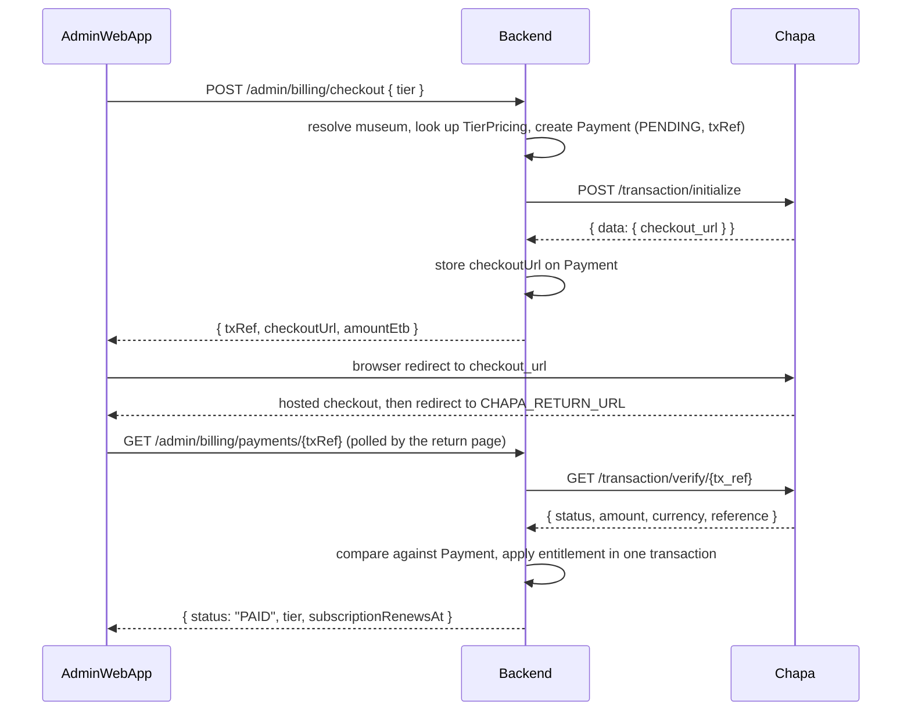

# Developer 3 — Integrations & Monetization

**Owner track:** every route that talks to an external vendor for **access** (ticket validation) or **money** (Chapa subscription billing), plus the tier-limit enforcement that billing exists to back.

**Parent spec:** `backend-implementation-plan.md` (v2). This document is a *track plan*, not a replacement — where v2 specifies something (error envelope, provider adapters, testing approach), this document follows it and points at the section rather than restating it. Where this document adds something v2 does not have, that addition is flagged explicitly in §1.2.

**Payment rail:** **Chapa**, not Telebirr. Rationale and the concrete differences that follow from the swap are in §6.1.

---

## Table of contents

1. [Scope, and how this track relates to v2](#1-scope-and-how-this-track-relates-to-v2)
2. [Dependencies and day-one unblocking](#2-dependencies-and-day-one-unblocking)
3. [Files owned, files shared](#3-files-owned-files-shared)
4. [Schema additions](#4-schema-additions)
5. [Environment variables](#5-environment-variables)
6. [Chapa integration](#6-chapa-integration)
7. [Subscription lifecycle](#7-subscription-lifecycle)
8. [Tier limits and `requireWithinTierLimit`](#8-tier-limits-and-requirewithintierlimit)
9. [Billing API](#9-billing-api)
10. [Ticket validation](#10-ticket-validation)
11. [Provider adapters](#11-provider-adapters)
12. [Error codes owned by this track](#12-error-codes-owned-by-this-track)
13. [Testing](#13-testing)
14. [Build order and checkpoints](#14-build-order-and-checkpoints)
15. [Definition of done](#15-definition-of-done)
16. [Open questions](#16-open-questions)

---

## 1. Scope, and how this track relates to v2

### 1.1 What this track owns

| Area | Routes | Spec |
|---|---|---|
| Ticket validation | `POST /tickets/validate`, `POST /stub-ticket-vendor` | v2 §15, extended here in §10 |
| Subscription billing | `POST /admin/billing/checkout`, `GET /admin/billing/status`, `GET /admin/billing/plans`, `GET /admin/billing/payments/:txRef`, `POST /admin/billing/tier` | §9 |
| Payment confirmation | `applyPaidPayment`, `scripts/reconcile-payments.ts` | §6.4, §6.5 |
| Tier enforcement | `requireWithinTierLimit` middleware | §8 |

Both halves of this track are **sensitive in the same way**: a ticket check gates access and a payment confirmation grants entitlement, and each has to be trustworthy while talking to a third party that can fail, stall, or lie. That is a different security emphasis from Dev 1's JWT auth (authenticated callers, tenant scoping) and Dev 2's LLM grounding (untrusted text, no state change), which is why they pair as one person's ownership.

### 1.2 Amendments to v2

Three things in v2 need to be formally amended for this track to exist. Raise all three at the kickoff so they land as agreed changes, not as one developer quietly contradicting the spec.

| # | v2 says | Amendment |
|---|---|---|
| A1 | §20 Out of scope: "Billing or subscriptions for museums." | Removed. Superseded by §§4–9 of this document. What stays out of scope is any rail other than Chapa — no cards, no bank transfer, no second mobile-money provider — and any per-visitor charging. |
| A2 | §6.1 schema has no tier, subscription, or payment models. | Additions in §4. These are handed to Dev 1 as a schema patch, not applied independently — see §2.2. |
| A3 | §12 defines `LlmProvider`, `TtsProvider`, `StorageProvider`. | Two more adapters, `PaymentProvider` and `TicketProvider`, following the same interface-plus-fake pattern and the same §12.4 resilience wrapper. See §11. |

### 1.3 What this track deliberately does not build

- **No proration, no refunds, no invoices as documents.** An upgrade mid-period extends the period (§7.3); it does not compute a partial credit. Refunds are handled manually in the Chapa dashboard and reconciled by a system admin via `POST /admin/billing/tier`.
- **No automatic recurring charge.** Chapa's standard checkout is a one-off hosted payment; there is no card-on-file to re-charge for a mobile-money rail. Renewal is a *reminder plus a fresh checkout*, not a silent debit. See §7.2.
- **No self-serve signup.** A museum still comes into existence through `POST /admin/museums` by a system admin (v2 §14.1). Billing attaches to an existing museum; it does not create one.
- **No real ticketing vendor.** Stub only, per v2 §15.4, until one is chosen.
- **No tier gating for features that do not exist.** The tier table markets "beacons", "3D model hosting", "OpenHPS spatial routing", and "multi-building navigation". The schema has `Museum -> Room -> Item` and QR codes — none of those features exist. This track builds the *mechanism* (the tier field, the limit check, the payment flow) using **room count as the enforceable proxy for "floor"**. When those features land later they plug into `TIER_LIMITS` (§8.1) rather than needing a new gating system. Do not write dead code for unbuilt features.

---

## 2. Dependencies and day-one unblocking

### 2.1 The one real dependency

`requireWithinTierLimit` (§8) resolves a museum from the resource being acted on, which is the same resolution `requireMuseumScope` does (v2 §8.4). It must not duplicate that logic with its own body-trusting version — that would reintroduce exactly the bypass v2 §8.4 exists to prevent.

**Sequencing:** build `requireWithinTierLimit` against Dev 1's day-one **stub** middleware, but treat it as unverified until Dev 1's real `requireAuth` / `requireMuseumScope` land at the end of Phase 3. The joint checkpoint in §14 is where it gets re-verified against the real thing.

Everything else in this track — the Chapa adapter, the stub ticket vendor, the schemas, the fake payment provider, the reconciler — depends only on the finalized Prisma schema, which is fixed on day one.

### 2.2 Schema handoff protocol

Do **not** create a second Prisma migration in parallel with Dev 1. Two developers running `prisma migrate dev` against the same schema produces a migration history that conflicts on merge and is painful to unwind.

Instead: hand Dev 1 the model definitions in §4 on day one, as a patch to `prisma/schema.prisma`, to be included in the **initial** migration. The billing tables being empty in Phase 1 costs nothing; a divergent migration history costs a day.

### 2.3 What Dev 3 owes the other teams on day one

Per v2 Phase 0, the admin-web developer is blocked on the contract, not the implementation. Ship on day one:

- Zod schemas for every request and response in §9 and §10.
- The corresponding entries in `openapi/openapi.yaml`.
- Mock fixtures: a `checkoutUrl` pointing at a local fake checkout page, a `GET /admin/billing/status` payload for each of the three tiers, and one `403 TIER_LIMIT_EXCEEDED` example so the admin app can build the upgrade prompt before billing works.

---

## 3. Files owned, files shared

Owned outright — no other developer should be editing these, so merge conflicts stay rare:

```
src/modules/billing/         router.ts  service.ts  schemas.ts  tiers.ts
src/modules/tickets/         router.ts  service.ts  schemas.ts
src/middleware/requireWithinTierLimit.ts
src/providers/payments/      types.ts  chapa.ts  fake.ts  index.ts
src/providers/ticketing/     types.ts  http.ts  fake.ts  index.ts
src/lib/ssrfGuard.ts
tests/integration/billing.test.ts
tests/integration/checkout.test.ts
tests/integration/tier-limits.test.ts
tests/integration/tickets.test.ts
scripts/reconcile-payments.ts
```

Shared — every edit here needs a heads-up in the team channel because all three developers touch them:

| File | Dev 3's edit |
|---|---|
| `prisma/schema.prisma` | §4 models, via Dev 1 (§2.2) |
| `prisma/seed.ts` | `TierPricing` rows |
| `src/app.ts` | Mounting the billing and tickets routers |
| `src/config/env.ts` | The variables in §5 |
| `src/lib/errors.ts` | The codes in §12 |
| `openapi/openapi.yaml` | This track's routes |

---

## 4. Schema additions

Handed to Dev 1 per §2.2. Follows v2 §6.1 conventions: explicit referential actions, `createdAt`/`updatedAt` on anything editable, indexes on every foreign key used in a filter.

```prisma
enum SubscriptionTier {
  BASIC
  PRO
  ENTERPRISE
}

enum SubscriptionStatus {
  ACTIVE      // paid and current
  PAST_DUE    // period ended without a renewal payment
  CANCELED    // opted out, or removed from the platform
}

enum PaymentStatus {
  PENDING     // checkout created, no confirmation yet
  PAID        // verified against Chapa's verify endpoint
  FAILED      // Chapa reported failure, or verification mismatched
  EXPIRED     // abandoned checkout, closed by the reconciler
}

model Museum {
  // ...existing v2 fields...
  tier                 SubscriptionTier   @default(BASIC)
  subscriptionStatus   SubscriptionStatus @default(ACTIVE)
  subscriptionRenewsAt DateTime?
  billingEmail         String?            // where renewal reminders go; falls back to the first MUSEUM_ADMIN's email

  payments Payment[]

  @@index([subscriptionStatus, subscriptionRenewsAt])   // drives the daily lapse sweep (§7.2)
}

model TierPricing {
  tier         SubscriptionTier @id
  amountEtb    Decimal          @db.Decimal(10, 2)
  periodDays   Int              @default(30)
  displayName  String
  description  String?
  active       Boolean          @default(true)
  updatedAt    DateTime         @updatedAt
}

model Payment {
  id                String        @id @default(uuid())
  museumId          String
  museum            Museum        @relation(fields: [museumId], references: [id], onDelete: Restrict)
  tier              SubscriptionTier
  amountEtb         Decimal       @db.Decimal(10, 2)
  currency          String        @default("ETB")
  txRef             String        @unique      // our reference, sent to Chapa as tx_ref
  chapaReference    String?                    // Chapa's ref_id, filled in on confirmation
  checkoutUrl       String?       @db.Text
  status            PaymentStatus @default(PENDING)
  failureReason     String?                    // set when status = FAILED, for support
  periodStart       DateTime?                  // set on PAID
  periodEnd         DateTime?                  // set on PAID; becomes Museum.subscriptionRenewsAt
  initiatedByAdminId String?
  createdAt         DateTime      @default(now())
  updatedAt         DateTime      @updatedAt
  paidAt            DateTime?

  @@index([museumId, createdAt])
  @@index([status, createdAt])   // drives the reconciler (§6.5)
}

// Audit rows attributed to no human — the reconciler applying a payment —
// carry a null actor. SetNull rather than Cascade so the trail outlives the
// account that produced it.
model AdminAuditLog {
  // ...existing v2 fields...
  adminUserId String?
  adminUser   AdminUser? @relation(fields: [adminUserId], references: [id], onDelete: SetNull)
}
```

Design notes worth defending at review:

**`Payment.txRef` is unique and generated by us**, not by Chapa. Format: `adwa-{museumSlug}-{tier}-{ulid}`. It is the join key between our records and Chapa's, and it appears in the Chapa dashboard where a human will read it during a support call.

**Idempotency comes from a conditional update, not a ledger.** `applyPaidPayment` writes through `UPDATE ... WHERE txRef = ? AND status = 'PENDING'`. Concurrent callers race harmlessly: the first wins, the rest see zero rows affected and return without acting. That is a normal outcome, not an error.

**`periodStart`/`periodEnd` live on `Payment`, not just on `Museum`.** `Museum.subscriptionRenewsAt` is the current answer; the `Payment` rows are the history of how it got there. Without the history, a billing dispute is unanswerable.

**No `Museum` delete path is added.** `Payment.museum` is `onDelete: Restrict`, consistent with v2's rule that museums are suspended, never hard-deleted. A museum with payment history especially must not be deletable.

---

## 5. Environment variables

Added to `src/config/env.ts`, Zod-validated, process refuses to boot if malformed (v2 §5).

```bash
# Chapa (see §6)
CHAPA_SECRET_KEY=                 # CHASECK_TEST-... in sandbox, CHASECK-... in live
CHAPA_BASE_URL=https://api.chapa.co/v1
CHAPA_RETURN_URL=                 # admin web app billing page; UX only, never authoritative
CHAPA_TIMEOUT_MS=10000
PAYMENTS_PROVIDER=chapa           # chapa | fake  (fake = tests and local dev)

# Ticketing (see §10)
TICKETS_PROVIDER=http             # http | fake
TICKET_VENDOR_TIMEOUT_MS=5000
ENABLE_STUB_TICKET_VENDOR=false   # must be false in production (§10.4)
STUB_TICKET_CODES=DEMO-1234,DEMO-5678,ADWA-VIP

# Shared guards
OUTBOUND_HTTP_ALLOW_PRIVATE_IPS=false   # true only in local dev, for the stub vendor on localhost
```

Two rules that the Zod schema should enforce rather than leave to discipline:

- If `NODE_ENV === 'production'`, then `ENABLE_STUB_TICKET_VENDOR` must be `false` and `OUTBOUND_HTTP_ALLOW_PRIVATE_IPS` must be `false`. Refuse to boot otherwise. A demo ticket code validating against a live deployment is not a hypothetical failure.
- If `NODE_ENV === 'production'`, `CHAPA_SECRET_KEY` must not start with `CHASECK_TEST-`. Booting production against sandbox keys means every payment silently succeeds without money moving.

---

## 6. Chapa integration

### 6.1 Why Chapa, and what changes versus the Telebirr design

The original monetization sketch targeted Telebirr's Fabric Payment Gateway. Chapa replaces it. The practical differences, since they change real code and not just a vendor name:

| Concern | Telebirr Fabric | Chapa |
|---|---|---|
| Credentials | `appId`, `appKey`, short code, plus an RSA key pair | A single secret key (bearer token) |
| Outbound auth | RSA-signed request payloads | `Authorization: Bearer <secret key>` |
| Session setup | Obtain a Fabric access token, then create an order | One call: `POST /transaction/initialize` |
| Confirmation of truth | The signed callback | `GET /transaction/verify/{tx_ref}`, called by us |
| Rails covered | Telebirr only | Telebirr, CBE Birr, M-Pesa, bank transfer, and cards through one checkout |

The last row is the substantive reason for the swap: a museum's finance office may not pay from a Telebirr wallet, and Chapa covers Telebirr *plus* the bank rails an institution actually uses, behind one integration.

The important architectural consequence: **RSA signing disappears, and a verify-before-grant step appears.** `GET /transaction/verify/{tx_ref}` is authenticated with our own secret key against Chapa's servers, and it is the only thing that grants entitlement. This is stricter than the Telebirr design it replaces, where the signed callback was itself authoritative.

**This track does not implement webhooks.** Chapa can push `charge.success` to a public endpoint, but that requires a publicly reachable URL, a tunnel in development, and a signature-verification path that is the single most error-prone part of the integration. Since the verify call is authoritative regardless of what prompted it, the webhook is only ever a latency optimisation. We drop it and prompt the verify from two places instead: the return page poll and the scheduled reconciler (§6.4).

### 6.2 Checkout flow



The return-page poll is the primary confirmation path, not a fallback. The reconciler (§6.5) covers the case where the admin never lands back on the return page.

### 6.3 `POST /transaction/initialize` — request construction

```
POST {CHAPA_BASE_URL}/transaction/initialize
Authorization: Bearer {CHAPA_SECRET_KEY}
Content-Type: application/json
```

```json
{
  "amount": "4500.00",
  "currency": "ETB",
  "email": "admin@adwamuseum.et",
  "first_name": "Adwa",
  "last_name": "Museum",
  "tx_ref": "adwa-adwa-museum-PRO-01HQ7Z...",
  "return_url": "https://admin.example.com/billing?tx_ref=adwa-adwa-museum-PRO-01HQ7Z...",
  "customization": {
    "title": "Adwa Subscription",
    "description": "PRO plan, 30 days"
  }
}
```

Rules for building it:

- **`amount` is a string with two decimals**, taken from `TierPricing.amountEtb`. Never accept an amount from the request body — the client sends a `tier`, and the price is looked up server-side. A client-supplied price is a client-chosen price.
- **`tx_ref` must be unique.** Generate it fresh per checkout attempt. If an admin abandons a checkout and starts another, that is a second `Payment` row with a second `tx_ref`, not a reused one.
- **`customization.title` is capped at 16 characters by Chapa.** Longer values are rejected by the API. Truncate deliberately rather than discovering this in sandbox.
- **`email` comes from `Museum.billingEmail`, falling back to the acting admin's email.** It appears on Chapa's receipt.
- A non-`success` `status` in the response body, or any non-2xx, maps to `502 UPSTREAM_FAILURE` per v2 §7.2. The raw Chapa body is logged with the request ID, never returned to the client. The `Payment` row is marked `FAILED` with `failureReason` set, so a support query can see the attempt happened.

### 6.4 `applyPaidPayment` — the single entitlement path

There is no webhook route. Nothing outside this service can push us into granting a tier; we pull the truth from Chapa on our own schedule. Two callers prompt that pull, and both go through one function in `src/modules/billing/service.ts`:

| Caller | When it runs | Covers |
|---|---|---|
| `GET /admin/billing/payments/:txRef` | Polled by the return page once the payment is >5s old | The common case: the admin lands back on the billing page |
| `scripts/reconcile-payments.ts` | Scheduled, every 10–15 minutes | The admin closed the tab, lost connectivity, or paid from another device |

**`applyPaidPayment(txRef)` algorithm:**

1. Load the `Payment` by `txRef`. Not found, or not `PENDING`, returns without acting. Already-applied entitlement is not applied twice.
2. **Call `GET /transaction/verify/{tx_ref}` and grant only from that response.** Confirm all of: `data.status === 'success'`, `data.currency === 'ETB'`, and `Number(data.amount)` equals `Payment.amountEtb` to the cent.
3. Any mismatch means `FAILED` with `failureReason`, a loud error log, and no entitlement. A payment that verified for the wrong amount is the exact fraud case this step exists to catch.
4. On a clean verify, in **one transaction**: set `Payment` to `PAID` with `paidAt`, `chapaReference`, `periodStart`, `periodEnd`; update `Museum` with the new `tier`, `subscriptionStatus: 'ACTIVE'`, and `subscriptionRenewsAt = periodEnd`; write an `AdminAuditLog` row.

**Concurrency.** The poll and the reconciler can fire on the same `txRef` at the same moment. The payment update is `UPDATE ... WHERE txRef = ? AND status = 'PENDING'`; a zero-row result means someone else already applied it, and the function returns `{ applied: false, reason: 'race_condition' }`. That is a normal outcome, not an error, and the transaction rolls back without touching the museum.

**Audit attribution.** The reconciler has no admin behind it, so `AdminAuditLog.adminUserId` is nullable and the row records a null actor rather than inventing one.

### 6.5 Reconciliation

With no webhook, the reconciler is not a safety net bolted on for completeness — it is one of only two confirmation paths, and the only one that works when the admin's browser is closed. **Ship it scheduled, or payments will be silently lost.**

`scripts/reconcile-payments.ts`, run every 10–15 minutes as a Render cron job:

- Every `PENDING` payment between 5 minutes and 24 hours old: verify and apply through `applyPaidPayment`. The 5-minute floor keeps the reconciler off payments the return page is actively polling.
- Every `PENDING` payment past 24 hours: one final verify, then `EXPIRED` if Chapa still reports nothing. The last check matters — a payment that succeeded while both the poll and the operator were asleep gets recovered instead of written off.
- `--sweep`: flip `ACTIVE` museums past `subscriptionRenewsAt` to `PAST_DUE` (§7.2).
- `--dry-run`: report without writing. Use it the first time you point this at production data.

A transient Chapa failure during a run is logged and skipped, not fatal; the next run picks the payment up again.

---

## 7. Subscription lifecycle

### 7.1 States

| `subscriptionStatus` | Set by | Visitor routes | Admin reads | Admin creates |
|---|---|---|---|---|
| `ACTIVE` | A verified payment, or a system-admin override | Serve normally | Allowed | Allowed, within tier limits |
| `PAST_DUE` | The daily sweep, when `subscriptionRenewsAt < now` | **Serve normally** | Allowed | Blocked, `403 SUBSCRIPTION_INACTIVE` |
| `CANCELED` | System admin | **Serve normally** | Allowed | Blocked, `403 SUBSCRIPTION_INACTIVE` |

**The rule that matters most in this whole track: a lapsed subscription never affects the visitor path.** A visitor standing in front of an exhibit with their phone out has no relationship to the museum's finance department. Content stays served. Only *adding new content* is blocked. If a museum is to be taken off the platform entirely, that is `MuseumStatus.SUSPENDED` (Dev 1's field, v2 §9.1) — a separate, deliberate, system-admin action, not an automatic consequence of a missed payment.

Note the two status fields are orthogonal and both are load-bearing: `MuseumStatus` controls whether the museum exists as far as visitors are concerned; `SubscriptionStatus` controls whether it can grow. Do not collapse them.

### 7.2 Renewal

No stored credential means no silent re-charge. The flow is:

- The daily sweep (Render cron, `scripts/reconcile-payments.ts --sweep`) finds museums with `subscriptionRenewsAt` inside the next 7 days and logs a renewal-due warning. Emailing is out of scope for now; `GET /admin/billing/status` surfaces `daysUntilRenewal` and the admin app shows the banner.
- When `subscriptionRenewsAt < now`, flip `ACTIVE` to `PAST_DUE`.
- The museum renews by running `POST /admin/billing/checkout` again with their current tier. `applyPaidPayment` extends the period per §7.3 and flips status back to `ACTIVE`.

### 7.3 Period arithmetic

`periodStart = max(now, museum.subscriptionRenewsAt ?? now)` and `periodEnd = periodStart + TierPricing.periodDays`.

Taking the max means an early renewal *extends* rather than *truncates* — a museum that renews a week early does not lose that week. A lapsed museum renewing after expiry starts fresh from now, which is the correct answer for a rail with no proration.

An upgrade mid-period changes the tier immediately and extends the period by a full `periodDays` at the new tier. Slightly generous, and much simpler than proration. Document that in the tier description so nobody is surprised; revisit if it is ever abused, which for a handful of contracted institutional customers it will not be.

---

## 8. Tier limits and `requireWithinTierLimit`

### 8.1 Limits live in code, prices live in the database

```ts
// src/modules/billing/tiers.ts
export const TIER_LIMITS = {
  BASIC:      { maxRooms: 1,        maxItemsPerRoom: 20, maxAdminUsers: 1 },
  PRO:        { maxRooms: 3,        maxItemsPerRoom: 50, maxAdminUsers: 5 },
  ENTERPRISE: { maxRooms: Infinity, maxItemsPerRoom: Infinity, maxAdminUsers: Infinity },
} as const;
```

The split is deliberate. A **price** change is a business decision that should be a data edit, not a deploy — hence `TierPricing`. A **limit** change is a behaviour change that needs a code review and a test run, because it alters what the API permits.

`maxRooms` is the "floor" proxy from §1.3. `maxItemsPerRoom` and `maxAdminUsers` are included because they are cheap to enforce with the same middleware and they stop the obvious workaround of cramming an entire museum into one enormous room.

### 8.2 Middleware behaviour

Applies to `POST /admin/rooms`, `POST /admin/items`, and `POST /admin/museums/:id/admins`.

1. Resolve the museum **from the database record being acted on**, exactly as v2 §8.4 requires — for a room create, from `req.admin.museumId` (or the system admin's explicit `museumId`, validated to exist); for an item create, from `room.museumId` looked up via `body.roomId`. **Never from a `museumId` in the body.** This resolution is shared with `requireMuseumScope`; extract it into one helper rather than writing it twice.
2. If `museum.subscriptionStatus !== 'ACTIVE'`, reject with `403 SUBSCRIPTION_INACTIVE`.
3. Count the relevant resource and compare against `TIER_LIMITS[museum.tier]`. On breach, reject with `403 TIER_LIMIT_EXCEEDED`.
4. Otherwise `next()`.

The error body carries enough for the admin app to render a useful upgrade prompt rather than a dead end:

```json
{
  "error": {
    "message": "The BASIC plan allows 1 room. Upgrade to add more.",
    "code": "TIER_LIMIT_EXCEEDED",
    "requestId": "01HQ...",
    "details": [{ "limit": "maxRooms", "tier": "BASIC", "allowed": 1, "current": 1 }]
  }
}
```

### 8.3 Three decisions to make explicitly, not by accident

**System admins are not exempt.** The limit is a property of the museum, not of the caller. A system admin who needs a museum to have four rooms changes that museum's tier (`POST /admin/billing/tier`, which is audit-logged) rather than quietly overshooting its plan. This keeps "what is this museum entitled to" answerable from one field.

**Downgrades never delete content.** A museum that drops from PRO to BASIC with three rooms keeps all three. They simply cannot create a fourth. Enforcement is on the *create* path only — never write a job that prunes rooms to fit a plan.

**Updates are not gated, only creates.** `PATCH /admin/rooms/:id` on an over-limit museum still works. Blocking edits would mean a museum that lapses cannot fix a factual error in content that is still being served to visitors, which is a worse outcome than any revenue it protects.

---

## 9. Billing API

All routes require `requireAuth` (v2 §8.2). Scoped routes additionally resolve the museum from the record and reject cross-tenant access with `403 CROSS_TENANT_ACCESS`.

### 9.1 `GET /admin/billing/plans`

Any authenticated admin. Returns active `TierPricing` rows joined with `TIER_LIMITS`, so the admin app renders one pricing table from one source.

```json
{
  "plans": [
    { "tier": "BASIC", "displayName": "Basic", "amountEtb": "1500.00", "currency": "ETB",
      "periodDays": 30, "limits": { "maxRooms": 1, "maxItemsPerRoom": 20, "maxAdminUsers": 1 } },
    { "tier": "PRO", "displayName": "Pro", "amountEtb": "4500.00", "currency": "ETB",
      "periodDays": 30, "limits": { "maxRooms": 3, "maxItemsPerRoom": 50, "maxAdminUsers": 5 } },
    { "tier": "ENTERPRISE", "displayName": "Enterprise", "amountEtb": "12000.00", "currency": "ETB",
      "periodDays": 30, "limits": { "maxRooms": null, "maxItemsPerRoom": null, "maxAdminUsers": null } }
  ]
}
```

`null` means unlimited — `Infinity` is not valid JSON, and serializing it produces `null` anyway, so make that intentional.

Seed prices are placeholders pending Q1 in §16.

### 9.2 `POST /admin/billing/checkout` *(scoped)*

**Request:** `{ "tier": "PRO" }`. A `MUSEUM_ADMIN` buys only for their own museum; a `SYSTEM_ADMIN` must pass `museumId`.

1. Validate the tier exists and is `active` in `TierPricing`.
2. Reject a checkout for the museum's *current* tier when `subscriptionStatus === 'ACTIVE'` and renewal is more than 7 days away, with `409 CONFLICT`. Nothing is broken about paying early, but it is almost always a double-click, and it is cheaper to block than to refund.
3. Reject with `429 RATE_LIMITED` if there are more than 5 `PENDING` payments for this museum in the last hour — a stuck admin clicking repeatedly should not generate twenty Chapa sessions.
4. Create the `Payment` row, call Chapa, store `checkoutUrl`, audit-log the attempt.

**Response `201`:**

```json
{
  "txRef": "adwa-adwa-museum-PRO-01HQ7Z...",
  "checkoutUrl": "https://checkout.chapa.co/checkout/payment/xyz",
  "tier": "PRO",
  "amountEtb": "4500.00",
  "currency": "ETB",
  "expiresHint": "Complete payment within 24 hours."
}
```

### 9.3 `GET /admin/billing/status` *(scoped)*

`SYSTEM_ADMIN` may pass `?museumId=`; a `MUSEUM_ADMIN`'s own museum is used and any supplied `museumId` is **ignored, not honoured** — the same rule as v2 §14.2 for rooms.

```json
{
  "museumId": "uuid",
  "tier": "PRO",
  "subscriptionStatus": "ACTIVE",
  "subscriptionRenewsAt": "2026-08-24T00:00:00.000Z",
  "daysUntilRenewal": 30,
  "limits": { "maxRooms": 3, "maxItemsPerRoom": 50, "maxAdminUsers": 5 },
  "usage":  { "rooms": 2, "adminUsers": 1 },
  "payments": [
    { "txRef": "adwa-...", "tier": "PRO", "amountEtb": "4500.00", "status": "PAID",
      "paidAt": "2026-07-25T09:12:00.000Z", "chapaReference": "APqDvY..." }
  ],
  "nextCursor": null
}
```

Returning `limits` alongside `usage` lets the admin app show "2 of 3 rooms used" without hardcoding the plan table, and means a limit change in `tiers.ts` propagates to the UI without a frontend deploy.

### 9.4 `GET /admin/billing/payments/:txRef` *(scoped)*

The primary confirmation path, polled by the return page. If the payment is still `PENDING` and older than 5 seconds, perform a live `GET /transaction/verify/{tx_ref}` through `applyPaidPayment` before responding. Rate-limit to 1 verify per `txRef` per 5 seconds so a polling loop does not become a Chapa load test.

Returns the `Payment` projection from §9.3 plus the museum's resulting `tier` and `subscriptionRenewsAt`.

### 9.5 `POST /admin/billing/tier` *(system)*

Manual override, `{ museumId, tier, subscriptionStatus?, subscriptionRenewsAt?, reason }`. Every enterprise deal signed offline, every goodwill extension, and every refund reconciliation runs through here. `reason` is required and goes into `AdminAuditLog`. Without this route, the only way to fix a billing state is a manual database edit, which leaves no trail.

---

## 10. Ticket validation

Follows v2 §15. Everything below is either that spec restated as build steps, or an addition marked as such.

### 10.1 `POST /tickets/validate`

Public — a visitor has no account and no token. **Request:** `{ museumId, ticketCode }`. **Response:** `{ valid, ticketRequired }`.

1. Look up the museum. `404` if missing or `SUSPENDED`.
2. `ticketValidationUrl == null` → return `{ valid: true, ticketRequired: false }` immediately. No external call, no gate, no cost. This is the path almost every museum takes and it must add zero latency.
3. Otherwise call the URL server-side through the `TicketProvider` adapter, 5s timeout with one retry (v2 §12.4), and map the response to `{ valid: boolean, ticketRequired: true }`.
4. On upstream failure, `502 UPSTREAM_FAILURE`. **Never fail open.** A gate that returns `valid: true` when the vendor is down is decorative.

Additions to v2:

- **Rate limit: 10 per IP per minute, plus 30 per museum per minute.** Ticket codes are short and guessable; without a limit this route is a free brute-force oracle. v2 specifies rate limits for `/chat` and `/narrate` but not here.
- **Never echo the vendor's response body to the client.** Map to a boolean and discard the rest. Vendor errors sometimes contain the ticket holder's name or order details.
- **Log every validation attempt** with museum ID, outcome, and a hash of the code — never the code itself.

### 10.2 SSRF — the part v2 does not cover

`ticketValidationUrl` is **admin-supplied input that the server makes an HTTP request to**. That is a server-side request forgery primitive by construction. A museum admin — the least-privileged authenticated role in the system — can point it at anything the backend container can reach: the cloud metadata endpoint at `169.254.169.254`, the internal Postgres port, another service on the private network.

`src/lib/ssrfGuard.ts`, applied both when the URL is **saved** (`PATCH /admin/museums/:id`, which is Dev 1's route — coordinate) and again when it is **called** (DNS can be re-pointed after validation):

- Scheme must be `https` (allow `http` only when `NODE_ENV !== 'production'`, for the local stub).
- Resolve the hostname and reject any address in a private, loopback, link-local, or reserved range: `10/8`, `172.16/12`, `192.168/16`, `127/8`, `169.254/16`, `::1`, `fc00::/7`. Gate the exception on `OUTBOUND_HTTP_ALLOW_PRIVATE_IPS`.
- Pin the connection to the resolved address, or re-check after resolution, to close the DNS-rebinding window between check and connect.
- `redirect: 'manual'` — a `302` to `http://169.254.169.254/` defeats every check above if redirects are followed.
- Cap the response body at 64 KB and the whole call at 5 seconds.
- No default port other than 443/80.

### 10.3 Per-museum vendor credentials

v2 §15.2 says the vendor's API key "lives in backend config scoped to that call", which works for one vendor and breaks for per-museum URLs. Proposal, to be agreed with Dev 1 since it is a `Museum` field: add `ticketValidationSecret String?`, encrypted at rest with an app-level key (AES-256-GCM, key in `TICKET_SECRET_ENC_KEY`), sent as a bearer token on the outbound call, and **never returned by any read route** — `GET /admin/museums/:id` returns `hasTicketValidationSecret: boolean`, never the value.

If that is more than the stub phase needs, the alternative is to defer it until a real vendor is chosen and keep the stub credential-free. Flag the decision rather than silently building either.

### 10.4 The stub vendor

`POST /stub-ticket-vendor`, request `{ ticketCode }`, response `{ valid: boolean }`, checked against `STUB_TICKET_CODES`.

- **Registered only when `ENABLE_STUB_TICKET_VENDOR === true`**, which §5 forbids in production. Not "returns 403 in production" — the route is not mounted at all, so there is nothing to find.
- Add a fixed ~150ms delay and one code that always returns `valid: false` and one that always times out. A stub that only ever succeeds instantly tests none of the failure handling this route exists to have.

Swapping in a real vendor later changes one config value per museum. `/tickets/validate` itself changes only if the vendor's response cannot be mapped to a boolean, in which case the mapping in `providers/ticketing/http.ts` is the single place that changes.

---

## 11. Provider adapters

Same pattern as v2 §12: a narrow interface, a real implementation, a fake for tests, and the shared timeout/retry/circuit-breaker wrapper from §12.4. Route and service code never imports a vendor SDK, and never calls `fetch` directly.

```ts
// src/providers/payments/types.ts
interface PaymentProvider {
  readonly name: string;
  initialize(input: {
    txRef: string;
    amount: string;          // two-decimal string, already formatted
    currency: 'ETB';
    email: string;
    firstName: string;
    lastName: string;
    title: string;           // <= 16 chars
    description: string;
    returnUrl: string;
    signal?: AbortSignal;
  }): Promise<{ checkoutUrl: string; providerRef?: string }>;

  verify(txRef: string, signal?: AbortSignal): Promise<{
    status: 'success' | 'pending' | 'failed';
    amount: string;
    currency: string;
    reference: string | null;
    raw: unknown;            // logged, never returned to a client
  }>;
}
```

```ts
// src/providers/ticketing/types.ts
interface TicketProvider {
  readonly name: string;
  validate(input: {
    endpointUrl: string;
    ticketCode: string;
    secret?: string;
    signal?: AbortSignal;
  }): Promise<{ valid: boolean }>;
}
```

`fake.ts` for each drives the test suite: a scriptable fake payment provider that can be told to succeed, fail, time out, or return a mismatched amount, and a fake ticket provider with the same range. **No test ever makes a network call or spends money** — the same rule v2 §17.1 sets for the other providers.

Resilience settings for this track: Chapa 10s timeout, one retry on timeout or 5xx only; ticket vendor 5s, one retry. **Never retry the verify call more than once** — a slow verify is better handled by the reconciler picking it up 15 minutes later than by holding an admin's polling request open.

---

## 12. Error codes owned by this track

Added to `src/lib/errors.ts`, extending v2 §7.2. Same envelope, no exceptions.

| Status | Code | When |
|---|---|---|
| 403 | `TIER_LIMIT_EXCEEDED` | Create blocked by the museum's plan limit. `details` carries limit, tier, allowed, current. |
| 403 | `SUBSCRIPTION_INACTIVE` | `subscriptionStatus` is `PAST_DUE` or `CANCELED` and the caller is creating a resource. |
| 409 | `PAYMENT_ALREADY_PENDING` | A duplicate checkout for the same tier while one is outstanding. |
| 404 | `PAYMENT_NOT_FOUND` | Unknown `txRef` on a scoped read. |
| 422 | `TICKET_URL_INVALID` | `ticketValidationUrl` failed the SSRF guard (§10.2). |
| 502 | `UPSTREAM_FAILURE` | Chapa or the ticket vendor errored. Generic message out, full detail logged. |
| 503 | `UPSTREAM_UNAVAILABLE` | Circuit breaker open against Chapa or the ticket vendor. |

---

## 13. Testing

Integration tests, Vitest and Supertest against a throwaway Postgres, fakes for both providers — v2 §17.1.

### 13.1 Tier isolation matrix

The billing extension of v2's §17.2 table. Same principle: automated tests running on every commit, not a checklist run once.

| # | Scenario | Expected |
|---|---|---|
| 1 | Museum A admin calls `POST /admin/billing/checkout` with `museumId` = B | `403 CROSS_TENANT_ACCESS` |
| 2 | Museum A admin calls `GET /admin/billing/status?museumId=<B>` | `200`, containing **only A's** data — assert the contents, not just the status |
| 3 | Museum A admin reads `GET /admin/billing/payments/:txRef` for B's payment | `403` |
| 4 | Museum A admin calls `POST /admin/billing/tier` | `403 FORBIDDEN` (system-only) |
| 5 | `SYSTEM_ADMIN` reads any museum's billing status | `200` — intentional |
| 6 | BASIC museum with 1 room creates a second | `403 TIER_LIMIT_EXCEEDED` |
| 7 | PRO museum with 3 rooms creates a fourth | `403 TIER_LIMIT_EXCEEDED` |
| 8 | ENTERPRISE museum creates a tenth room | `201` |
| 9 | `PAST_DUE` museum creates a room | `403 SUBSCRIPTION_INACTIVE` |
| 10 | `PAST_DUE` museum's rooms via `GET /waypoint/:id` | `200` — visitors are never affected (§7.1) |
| 11 | `PAST_DUE` museum `PATCH`es an existing room | `200` — edits are not gated (§8.3) |
| 12 | PRO museum downgraded to BASIC with 3 existing rooms | Rooms intact; a fourth is rejected |
| 13 | `SYSTEM_ADMIN` creates a fourth room on a PRO museum | `403 TIER_LIMIT_EXCEEDED` — limits bind the museum, not the caller (§8.3) |

### 13.2 Payment confirmation tests

Driven entirely through the fake provider's modes, against `applyPaidPayment` and the two routes that call it.

| # | Scenario | Expected |
|---|---|---|
| 1 | Verify reports `success`, amount and currency match | Payment `PAID`, museum upgraded, audit row written |
| 2 | Verify reports a different amount than the `Payment` row | Payment `FAILED`, **no upgrade**, error logged |
| 3 | Verify reports a different currency | Payment `FAILED`, no upgrade |
| 4 | Verify reports `failed` | Payment `FAILED`, no upgrade |
| 5 | Verify reports `pending` | Payment stays `PENDING`, no upgrade, no error |
| 6 | `applyPaidPayment` called twice on the same `txRef` | Exactly one upgrade, one audit row |
| 7 | Poll and reconciler apply the same payment concurrently | Exactly one upgrade; the loser returns `race_condition` |
| 8 | Unknown `txRef` | Returns `payment_not_found`, nothing leaked to the caller |
| 9 | Chapa times out during verify | Payment stays `PENDING`, error logged, next run retries |
| 10 | Poll on a payment younger than 5s | No verify call at all (assert the fake's call count) |
| 11 | Reconciler on a payment older than 24h with nothing at Chapa | Payment `EXPIRED` |
| 12 | Reconciler on a payment older than 24h that did succeed | Recovered to `PAID`, not expired |

Cases 6 and 7 are the ones worth writing first. With two independent confirmation paths and no webhook ledger, the conditional-update guard in `applyPaidPayment` is the only thing preventing a double upgrade.

### 13.3 Ticket tests

Museum with no URL returns `{ valid: true, ticketRequired: false }` with zero outbound calls (assert on the fake's call count). Stub codes pass and fail correctly. Vendor timeout produces `502`, **not** `valid: true`. Vendor 500 produces `502`. Suspended museum produces `404`. Rate limit produces `429` with `Retry-After`. SSRF guard rejects `http://169.254.169.254/`, `http://localhost:5432/`, `file:///etc/passwd`, and a URL that `302`s to a private address.

### 13.4 Chapa sandbox pass — manual, once per environment

Automated tests use the fake, so nothing above proves the real integration works. Before this track is done, run end to end against Chapa's sandbox with test keys and record the result:

1. `POST /admin/billing/checkout` → open the returned `checkoutUrl` in a browser.
2. Complete a sandbox payment. Confirm the redirect lands on `CHAPA_RETURN_URL` with `tx_ref`.
3. Confirm the return page poll verifies against Chapa and the tier upgrades.
4. Repeat, but close the tab immediately after paying. Confirm the reconciler catches it on the next run.
5. Attempt a payment and abandon it; confirm it becomes `EXPIRED` rather than sitting `PENDING`.

Step 4 is the one people skip. It is also the one that proves the reconciler is scheduled and working, which with no webhook is the difference between a recoverable payment and a lost one.

---

## 14. Build order and checkpoints

Ordered by dependency. Steps 1–4 need nothing from Dev 1 beyond the day-one schema.

**Step 1 — Contract (day 1, parallel with Dev 1's schema).** Schema patch (§4) handed over. Zod schemas and OpenAPI entries for every route in §9 and §10. Env additions with the production guards from §5. Error codes from §12. Fake providers. Fixtures for the admin app.

**Step 2 — Ticket validation (v2 Phase 8, pullable earlier).** `TicketProvider`, the SSRF guard, `/tickets/validate`, the stub vendor, and §13.3's tests. Small, self-contained, no dependency on billing — a good first shipped increment.

**Step 3 — Chapa adapter and the entitlement path.** `PaymentProvider` implementation against the sandbox. `applyPaidPayment` as the single shared entitlement path, with the conditional-update guard. The reconciler. §13.2's tests against the fake.

**Step 4 — Billing API.** Checkout, status, plans, payment lookup, manual tier override. `TierPricing` seed data. Audit logging on every write.

**Step 5 — Tier enforcement.** `requireWithinTierLimit` against Dev 1's **real** middleware, not the stub. Sequence this after Dev 1's Phase 3 lands. §13.1's matrix green.

**Step 6 — Reconciliation and lifecycle.** The reconciler script, the daily lapse sweep, Render cron wiring, concurrency test (§13.2 #11).

**Step 7 — Sandbox pass and hardening.** §13.4 end to end. Confirm every Chapa failure mode degrades visibly, per v2 §7.3.

**Joint checkpoints** — these need all three developers, not a solo sign-off:

- **After Dev 1's Phase 4.** Re-run §13.1 against the real auth middleware. The specific risk is `requireWithinTierLimit` and `requireMuseumScope` resolving the museum differently; they must share one helper.
- **After v2's Phase 9.** Full-system pass: v2 §17.2's matrix plus §13.1's, Dev 2's §10.5 adversarial chat pass, and a full Chapa sandbox payment from checkout through verify to tier upgrade.

---

## 15. Definition of done

- [ ] Every route in §9 and §10 implemented, matching `openapi.yaml` exactly.
- [ ] §13.1, §13.2, and §13.3 green in CI.
- [ ] §13.4's sandbox pass completed and recorded, including the closed-tab run.
- [ ] No route in this track returns a raw upstream body to a client; all upstream detail is logged with a request ID.
- [ ] The reconciler is scheduled in every environment that takes real money.
- [ ] Entitlement is granted only after `GET /transaction/verify`, and `applyPaidPayment` is the only function that grants it.
- [ ] Production boot fails if the stub vendor is enabled or a test Chapa key is configured.
- [ ] A lapsed subscription demonstrably does not affect `GET /waypoint/:id`, `POST /chat`, or `GET /narrate/*`.
- [ ] `TIER_LIMITS` is the only place limits are expressed; the admin app reads them from `GET /admin/billing/plans`.
- [ ] Every billing state change has an `AdminAuditLog` row explaining it, with a null actor when the reconciler was responsible.

---

## 16. Open questions

Each blocks a specific step; resolve before that step, not at the end.

| # | Question | Blocks |
|---|---|---|
| Q1 | Actual ETB prices per tier. §9.1's numbers are placeholders. Also: monthly or annual billing period, given that Ethiopian institutional budgets are typically annual? | Step 4 |
| Q2 | Is the Chapa merchant account registered, and are sandbox keys available? Merchant onboarding is a business step with a lead time and it gates the only unmockable part of this track. | Step 3 |
| ~~Q3~~ | ~~Does `CHAPA_WEBHOOK_SECRET` mean the dashboard's secret hash or the API secret key?~~ Retired — there is no webhook. | — |
| Q4 | Encrypted per-museum `ticketValidationSecret` now, or defer until a real vendor is chosen (§10.3)? Needs Dev 1's agreement — it is a `Museum` field. | Step 2 |
| Q5 | Renewal reminders by email — in scope, and if so which sender? Currently only surfaced in `GET /admin/billing/status`. | Step 6 |
| Q6 | What happens to a museum that never renews? Indefinite `PAST_DUE` serving visitor content for free, or a system-admin `SUSPENDED` decision after N days? This is a policy call, not a technical one. | Step 6 |
| Q7 | Does the Louvre dataset (v2 Q5) represent a paying tenant or a test fixture? If it is a fixture, exclude it from the lapse sweep so it does not generate noise. | Step 6 |

