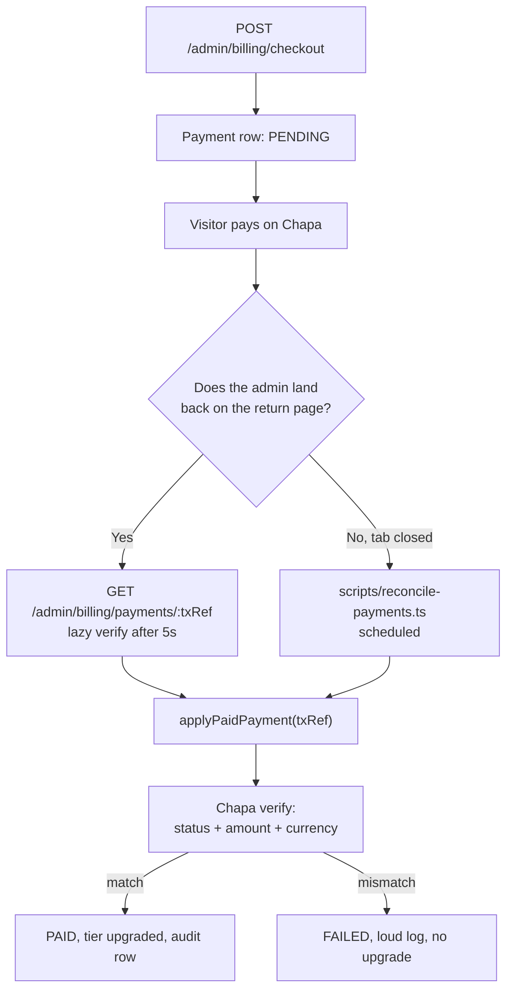

# Dev 3 ΓÇö Working Document

The step-by-step build log for the Integrations and Monetization track, run locally in Docker. This is the file to keep open while implementing: every step states what gets built, what to run, and what "done" means before moving on.

**Specs:** [backend-implementation-plan.md](backend-implementation-plan.md) (v2, shared) and [dev3-integrations-monetization-plan.md](dev3-integrations-monetization-plan.md) (this track).
**Scope:** shared skeleton plus Dev 3's routes only. Dev 1's auth and admin CRUD are shaped stubs.
**Payments:** Chapa sandbox. **No webhooks and no tunnel** ΓÇö see "Payment confirmation without webhooks" below.

---

## Progress

| Step | What | Status |
|---|---|---|
| 0 | Scaffold and Docker | done, verified |
| 1 | Core libs and error envelope | done, verified |
| 2 | Schema, migration, seed | done, verified |
| 3 | Auth stubs | code done, partly verified |
| 4 | Provider adapters | code done, SSRF verified, Chapa sandbox unproven |
| 5 | Ticket validation | code done, fast path verified |
| 6 | Chapa checkout | code done, unverified |
| 7 | ~~Webhook~~ | **removed from scope** |
| 8 | Billing reads, tier limits, reconciler | done, reconciler smoke-run |
| 9 | Tests | done ΓÇö 47 passed, 2 skipped (Dev 1/2 routes) |

---

## Payment confirmation without webhooks

Webhooks were removed from this track. That leaves exactly two paths from `PENDING` to `PAID`, and both go through the same `applyPaidPayment(txRef)` function in `backend/src/modules/billing/service.ts`:



**The reconciler is not optional.** The lazy verify only runs while an admin has the return page open. If they close the tab mid-payment, the reconciler is the sole remaining path ΓÇö without it scheduled, that payment sits `PENDING` forever and the museum never gets the tier it paid for.

Schedule it every 10ΓÇô15 minutes in any environment taking real money.

---

## Step 0 ΓÇö Scaffold and Docker ΓÇö done

`backend/` holds `package.json`, `tsconfig.json` (strict, `noUncheckedIndexedAccess`, `exactOptionalPropertyTypes`), `Dockerfile` (dev and prod targets), `docker-compose.yml` (`db`, `db-test`, `api`), env files, and `src/{index,app}.ts`.

```bash
cd backend
docker compose up -d db db-test
docker compose up -d api
```

- [x] `curl.exe http://localhost:3000/health` returns `{"status":"ok","dbLatencyMs":33,"version":"0.1.0"}`.
- [x] `docker compose down && docker compose up -d` comes back clean.

**Two things that bit us and will bite again:**

1. `npm ci` needs a committed `package-lock.json`. Generate it with `npm install --package-lock-only` on the host before building.
2. The `api` service mounts an anonymous volume at `/app/node_modules`. Docker **keeps that volume across `docker compose up`**, so after any dependency change you must run `docker compose up -d --force-recreate --renew-anon-volumes api` or the container keeps the old packages and you will chase a phantom "module not found".

`bcrypt` was swapped for `bcryptjs` because the native addon cannot compile under `npm ci --ignore-scripts` on Alpine.

---

## Step 1 ΓÇö Core libs and the error envelope ΓÇö done

`src/config/env.ts` (Zod over `process.env`, parsed once, production guards), `src/lib/{logger,errors,asyncHandler,prisma}.ts`, `src/middleware/{requestId,errorHandler}.ts`.

- [x] `curl.exe http://localhost:3000/nope` returns the envelope with `error.code = "NOT_FOUND"` and a `requestId` matching the `X-Request-Id` header.
- [x] A Zod failure returns `400 VALIDATION_ERROR` with populated `details` (confirmed against `POST /tickets/validate`).
- [ ] Deleting a required variable from `.env` makes the container exit with a readable message. **Not yet exercised.**

---

## Step 2 ΓÇö Schema, migration, seed ΓÇö done

Three migrations applied: `init`, `drop_webhook_events`, `nullable_audit_actor`.

```bash
docker compose exec api npx prisma migrate deploy
docker compose exec api npx prisma db seed
docker compose exec api npx prisma studio
```

- [x] Migrations apply clean from an empty volume.
- [x] `TierPricing` has three rows; `adwa` is BASIC/ACTIVE, `louvre` is PRO/ACTIVE.
- [ ] Seed run twice produces no duplicates. Written to be idempotent (upsert on `slug` and `email`) but only run once end to end.

**`AdminAuditLog.adminUserId` is nullable**, with `onDelete: SetNull`. Null means the system acted with no human behind it ΓÇö the reconciler applying a payment. It was originally required with `onDelete: Cascade`, which was wrong twice over: the reconciler had no actor to name, and an audit trail should outlive the account that produced it.

---

## Step 3 ΓÇö Auth stubs shaped to Dev 1's contract ΓÇö code done

`src/middleware/{requireAuth,requireRole}.ts`, `src/lib/resolveMuseum.ts`, `src/modules/dev/router.ts`.

- [x] `POST /dev/login` returns tokens for the system admin, the adwa admin, and the louvre admin.
- [x] A route behind `requireAuth` returns `401` with no header and `401` with a garbage token.
- [ ] The same route returns `200` with a valid token. **Not yet confirmed** ΓÇö see the note below.

`resolveMuseum.ts` resolves the museum **from the database record being acted on**, never from the request body. Dev 1's `requireMuseumScope` and this track's `requireWithinTierLimit` must both call it, or the two will drift and one will have a bypass.

**Handoff note:** `requireAuth.ts` carries a comment marking it as a stub owned by Dev 1, so it does not accidentally survive into production.

---

## Step 4 ΓÇö Provider adapters ΓÇö code done

`src/providers/resilience.ts` (timeout, one retry on timeout or 5xx only, circuit breaker at 5 failures with a 30s half-open), `src/providers/payments/{types,chapa,fake}.ts`, `src/providers/ticketing/{types,http,fake}.ts`, `src/lib/ssrfGuard.ts`.

- [x] The SSRF guard rejects `169.254.169.254`, `localhost:5432`, `127.0.0.1`, `10/8`, `192.168/16`, `172.16/12`, and `file://`, while allowing `https://api.chapa.co/v1`.
- [ ] A call to Chapa sandbox `initialize` prints a real `checkout_url`. **Blocked** ΓÇö `.env` still holds the placeholder key and `PAYMENTS_PROVIDER=fake`.
- [ ] The fake provider driven into every failure mode. It supports `success`, `pending`, `fail`, `timeout`, `amount_mismatch`, and `currency_mismatch`, but nothing exercises them until step 9.

`verifyWebhookSignature` was removed from the `PaymentProvider` interface along with the webhook route.

---

## Step 5 ΓÇö Ticket validation ΓÇö code done

`src/modules/tickets/{schemas,service,router}.ts`, plus the stub vendor at `POST /stub-ticket-vendor` mounted only when `ENABLE_STUB_TICKET_VENDOR=true`.

- [x] A museum with no `ticketValidationUrl` returns `{"valid":true,"ticketRequired":false}` with zero outbound calls. This is the path nearly every museum takes and it adds no latency.
- [ ] Pointing `adwa` at the stub makes a good code pass and a bad code fail. Requires flipping `TICKETS_PROVIDER=http`.
- [ ] The timing-out code produces `502`, not `valid: true`.
- [ ] Setting `ticketValidationUrl` to a private address is rejected with `422 TICKET_URL_INVALID`. **Cannot be tested yet** ΓÇö the save-time path needs Dev 1's admin museum-update route, which does not exist. The guard itself is verified and runs on every outbound call.

Upstream failure is `502`. **Never fail open** ΓÇö a gate that passes when the vendor is down is decorative.

---

## Step 6 ΓÇö Chapa checkout ΓÇö code done, unverified

`src/modules/billing/{tiers,schemas,service,router}.ts`.

- [ ] Checkout returns a `checkout.chapa.co` URL that opens in a browser.
- [ ] A `Payment` row exists as `PENDING` with the matching `txRef`.
- [ ] Museum A's admin cannot check out for museum B.

Tier comes from the body, **price comes from the database**. A client-supplied price is a client-chosen price. `txRef` is `adwa-{slug}-{tier}-{ulid}`, never reused. `409 PAYMENT_ALREADY_PENDING` for a redundant checkout on the current tier when renewal is more than 7 days out; `429 RATE_LIMITED` past 5 pending payments in an hour.

**Before any of this can run against Chapa:** put a real `CHASECK_TEST-` key in `.env` and set `PAYMENTS_PROVIDER=chapa`.

---

## Step 8 ΓÇö Billing reads, tier limits, reconciler ΓÇö done

Routes in `src/modules/billing/router.ts`:

- `GET /admin/billing/plans` ΓÇö `TierPricing` joined with `TIER_LIMITS`; unlimited serializes as `null`, not `Infinity`.
- `GET /admin/billing/status` ΓÇö a museum admin's own museum only; a supplied `museumId` is **ignored, not honoured**.
- `GET /admin/billing/payments/:txRef` ΓÇö the route the return page polls; runs a live verify through `applyPaidPayment` once the payment is more than 5 seconds old.
- `POST /admin/billing/tier` ΓÇö system-only override with a required `reason`, audit-logged.

`src/middleware/requireWithinTierLimit.ts` resolves the museum via the shared helper, returns `403 SUBSCRIPTION_INACTIVE` when the subscription is not `ACTIVE`, and `403 TIER_LIMIT_EXCEEDED` with `details` carrying limit, tier, allowed, and current so the admin app can render an upgrade prompt instead of a dead end. System admins are **not** exempt. `PATCH` is never gated.

`scripts/reconcile-payments.ts`:

```bash
docker compose exec api npm run reconcile                 # verify + expire
docker compose exec api npx tsx scripts/reconcile-payments.ts --sweep
docker compose exec api npx tsx scripts/reconcile-payments.ts --dry-run
```

- `PENDING` between 5 minutes and 24 hours old: verify and apply through the shared path.
- `PENDING` past 24 hours: one last verify, then `EXPIRED` if Chapa still shows nothing. The final check exists so a payment that succeeded while both the poll and the operator were asleep is recovered rather than written off.
- `--sweep`: flip `ACTIVE` museums past `subscriptionRenewsAt` to `PAST_DUE`.
- `--dry-run`: report without writing.

- [x] Reconciler runs clean against an empty payment table and exits 0.
- [ ] BASIC museum at 1 room gets `403 TIER_LIMIT_EXCEEDED` on the second; PRO on the fourth; ENTERPRISE never.
- [ ] A `PAST_DUE` museum is blocked from creating but can still `PATCH`.
- [ ] Running the reconciler after an unpolled payment upgrades the museum.

Dev-only `POST /dev/rooms` in `app.ts` has the middleware attached so tier limits are manually exercisable before Dev 1's real route exists.

---

## Step 9 ΓÇö Tests ΓÇö done

```bash
docker compose exec api npm test
```

- [x] `tests/helpers/` ΓÇö truncate + fixtures against `db-test`, JWT minting, fake provider reset.
- [x] `tests/integration/tier-limits.test.ts` — §13.1 matrix (cases 10–11 skipped until Dev 1/2 routes exist).
- [x] `tests/integration/tickets.test.ts` — §13.3 plus SSRF guard cases.
- [x] `tests/integration/checkout.test.ts` — §13.2 confirmation matrix + reconciler expiry/sweep.

**Latest run:** 47 passed, 2 skipped.

---

## Manual sandbox pass

Once a real sandbox key is in place:

- [ ] Set `CHAPA_SECRET_KEY` and `PAYMENTS_PROVIDER=chapa`, restart `api`.
- [ ] Check out, confirm a real `checkout.chapa.co` URL opens.
- [ ] Pay in sandbox, land on the return page, confirm the poll upgrades the tier.
- [ ] Repeat but close the tab immediately after paying; confirm the reconciler catches it.
- [ ] Abandon a checkout; confirm it becomes `EXPIRED` rather than sitting `PENDING`.

---

## Environment reference

```bash
NODE_ENV=development
PORT=3000
DATABASE_URL=postgresql://adwa:adwa@db:5432/adwa
JWT_SECRET=                       # >= 32 chars
CORS_ALLOWED_ORIGINS=http://localhost:5173

CHAPA_SECRET_KEY=CHASECK_TEST-...
CHAPA_BASE_URL=https://api.chapa.co/v1
CHAPA_RETURN_URL=http://localhost:5173/billing
CHAPA_TIMEOUT_MS=10000
PAYMENTS_PROVIDER=fake            # chapa | fake

TICKETS_PROVIDER=fake             # http | fake
TICKET_VENDOR_TIMEOUT_MS=5000
ENABLE_STUB_TICKET_VENDOR=true    # must be false in production
STUB_TICKET_CODES=DEMO-1234,DEMO-5678,ADWA-VIP
OUTBOUND_HTTP_ALLOW_PRIVATE_IPS=true   # local only, so the stub on localhost is reachable

SEED_SYSTEM_ADMIN_EMAIL=system@adwa.local
SEED_SYSTEM_ADMIN_PASSWORD=
```

`config/env.ts` refuses to boot when `NODE_ENV=production` and any of `ENABLE_STUB_TICKET_VENDOR`, `OUTBOUND_HTTP_ALLOW_PRIVATE_IPS`, or a `CHASECK_TEST-` key is present.

---

## Gotchas to keep in view

1. **The reconciler is load-bearing.** With webhooks gone it is the only thing standing between a closed browser tab and a lost payment. Schedule it.
2. **Never grant from a client-supplied field.** Always confirm with a server-side verify call and compare amount, currency, and status before touching a tier.
3. **Never fail open on tickets.** A `502` is the correct answer when a vendor is down.
4. **`ticketValidationUrl` is admin-supplied SSRF input.** Guard it both when saved and when called; DNS can be re-pointed in between.
5. **A lapsed subscription never touches the visitor path.** Blocking a visitor because a museum's renewal failed is the worst outcome this track can produce.
6. **Coordinate migrations with Dev 1.** Parallel `prisma migrate dev` runs produce a history that conflicts on merge.
7. **Limits in code, prices in the database.** A price change should be a data edit; a limit change should require review.
8. **Renew anonymous volumes after a dependency change**, or the container silently keeps the old `node_modules`.

---

## Open questions

| # | Question | Blocks |
|---|---|---|
| Q1 | Real ETB prices per tier, and monthly versus annual periods. Seeded with placeholders: 1500 / 4500 / 12000. | Step 6 |
| Q4 | Encrypted per-museum ticket vendor credential now, or defer until a vendor exists? | Step 5 |
| Q6 | Policy for a museum that never renews: indefinite `PAST_DUE`, or suspension after N days? | Step 8 |

Q3 (which Chapa secret verifies a webhook signature) is retired — there is no webhook. Numbering otherwise matches dev3 §16 so the two documents stay cross-referenceable.
